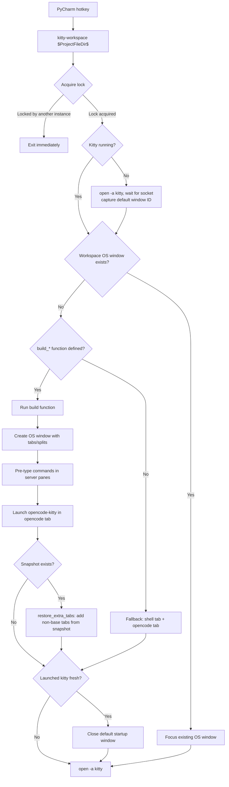
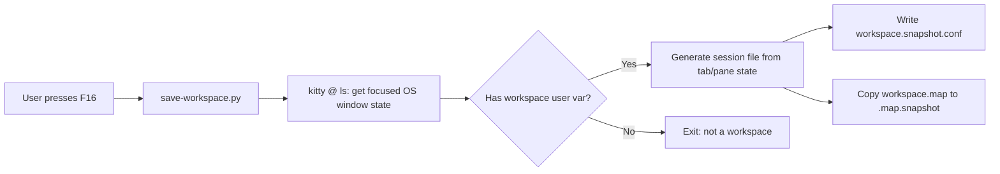
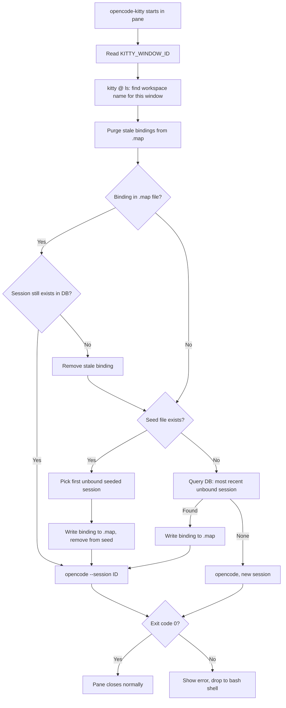

# Kitty-PyCharm Workspace Integration Specification

**Status:** Experimental (v1, initial implementation)
**Created:** 2026-04-20

## Overview

A system that integrates Kitty terminal workspaces with PyCharm via a single hotkey. Each project gets a dedicated Kitty OS window with tabs for servers, tools, and an opencode AI assistant. The hotkey either focuses an existing workspace or creates one from scratch, with opencode session resumption so conversations persist across workspace restarts.

The core design principle: Kitty is the terminal platform (rendering, window management, remote control), not a multiplexer. There is no detach/reattach -- Kitty stays open. Persistence comes from periodic snapshots that capture evolved layout state plus opencode session bindings.

## File Map

### Kitty Configuration

| Path | Purpose | Status |
|------|---------|--------|
| `~/.config/kitty/kitty.conf` | Main config: remote control, session keybindings, tab bar filter (30 lines) | Stable |
| `~/.config/kitty/kitty.conf.bak` | Backup of original config | Reference |
| `~/.config/kitty/mocha.conf` | Catppuccin Mocha color scheme (included from kitty.conf) | Stable |

### Session Files

| Path | Purpose | Status |
|------|---------|--------|
| `~/.config/kitty/sessions/seo-data-science.conf` | SEO workspace base session definition | Stable |
| `~/.config/kitty/sessions/tsc.conf` | TSC workspace base session definition | Stable |
| `~/.config/kitty/sessions/dotfiles.conf` | Dotfiles workspace base session definition | Stable |
| `~/.config/kitty/sessions/{workspace}.snapshot.conf` | Auto-generated snapshot of evolved workspace state | Runtime |

### Scripts

| Path | Purpose | Status |
|------|---------|--------|
| `~/.local/bin/kitty-workspace` | Workspace launcher (thin bash orchestrator calling kitty-query.py) | Experimental |
| `~/.local/bin/opencode-kitty` | OpenCode session binding (thin bash orchestrator calling kitty-query.py) | Experimental |
| `~/.config/kitty/kitty-query.py` | Shared Python module: all workspace logic (typer CLI, PEP 723 inline deps) | Experimental |
| `~/.config/kitty/save-workspace.py` | F16 handler: snapshot workspace state per project | Experimental |
| `~/.config/kitty/load-snapshot.py` | Snapshot parser for extra-tab restoration | Experimental |

### Chezmoi Infrastructure

| Path (chezmoi source) | Purpose |
|----------------------|---------|
| `run_once_create-kitty-socket-dir.sh` | Creates `~/.local/share/kitty/` on first `chezmoi apply` (required for socket) |
| `run_once_before_install-uv.sh` | Installs `uv` via mise (or curl fallback) on first `chezmoi apply` (required for kitty-query.py) |

### Tests (not deployed, in `.chezmoiignore`)

| Path | Purpose |
|------|---------|
| `tests/kitty/conftest.py` | Shared pytest fixtures (realistic `kitty @ ls` JSON, session file samples) |
| `tests/kitty/test_kitty_query.py` | Tests for kitty-query.py: 106 tests (unit + CLI integration) |
| `tests/kitty/test_save_workspace.py` | Tests for `find_active_workspace` and `generate_session_file` |
| `tests/kitty/test_load_snapshot.py` | Tests for `parse_session_file` |
| `tests/kitty/test_roundtrip.py` | Round-trip tests: `generate_session_file` → `parse_session_file` → verify equivalence |
| `pyproject.toml` | Project config: pytest settings, dependency groups (pytest, typer, plumbum) |
| `.github/workflows/test.yml` | CI: runs `uv run pytest tests/ -v` on push/PR (Python 3.12 + 3.13) |

### Storage (created at runtime)

| Path | Purpose | Format |
|------|---------|--------|
| `~/.local/share/opencode-kitty/{workspace}.map` | Live window-to-session bindings | `kitty_window_id=opencode_session_id` (one per line) |
| `~/.local/share/opencode-kitty/{workspace}.seed` | Session IDs to restore from snapshot | One session ID per line (consumed on use) |
| `~/.local/share/opencode-kitty/{workspace}.map.snapshot` | Backup of map at snapshot time | Same as .map |
| `~/.local/share/kitty/workspace.log` | Debug log (when `KITTY_WORKSPACE_DEBUG=1`) | Timestamped log lines |
| `/tmp/kitty-workspace.lock` | Prevents concurrent workspace creation (mkdir-based lock, 30s stale timeout) | Directory (presence = locked) |

### External Dependencies

| Dependency | Used by | Purpose |
|-----------|---------|---------|
| Kitty 0.43+ | All | Sessions, `save_as_session`, `tab_bar_filter`, remote control. Discovered via `command -v kitty` (bash) or `shutil.which("kitty")` (Python). |
| `uv` | kitty-workspace, opencode-kitty | Runs kitty-query.py with PEP 723 inline script metadata. Installed via `run_once_before_install-uv.sh`. |
| `python3` 3.12+ | kitty-query.py, save-workspace.py, load-snapshot.py | All Python logic |
| `typer` | kitty-query.py | CLI framework (auto-installed by uv from PEP 723 metadata) |
| `plumbum` | kitty-query.py | Subprocess calls to ps, lsof (auto-installed by uv) |
| `sqlite3` (stdlib) | kitty-query.py | Queries opencode's session database (parameterized queries, no SQL injection) |
| `opencode` | opencode-kitty | `opencode db path`, `opencode --session` |
| OpenCode SQLite DB | kitty-query.py | Session lookup (`~/.local/share/opencode/opencode.db`) |

## Architecture

### Kitty Remote Control Setup

Kitty must be configured for socket-based remote control:

```conf
# In kitty.conf
allow_remote_control socket-only
listen_on unix:~/.local/share/kitty/control-socket
```

Kitty appends `-{PID}` to the socket path at startup (e.g., `~/.local/share/kitty/control-socket-36767`). Scripts discover the socket via bash glob (`ls ~/.local/share/kitty/control-socket-* | head -1`) for speed, or via `kitty-query.py find-socket-cmd` in validate mode.

The socket directory (`~/.local/share/kitty/`) must exist before Kitty starts. This is handled automatically by chezmoi via `run_once_create-kitty-socket-dir.sh`, which runs `mkdir -p ~/.local/share/kitty` on first apply.

`socket-only` restricts remote control to the unix socket -- programs running inside Kitty terminals cannot send remote control commands unless they connect to the socket explicitly. This is more secure than `allow_remote_control yes`.

### Workspace Detection: User Variables

Each workspace's first pane is tagged with a Kitty user variable:

```bash
kitty @ launch --type=os-window --var workspace="seo-data-science" ...
```

This persists in Kitty's state and is queryable via `kitty @ ls`:

```json
{"user_vars": {"workspace": "seo-data-science"}}
```

Detection uses this marker to find existing workspaces and avoid duplicates. It also allows `opencode-kitty` to determine which workspace it belongs to without any environment variable passing.

### PyCharm External Tool Configuration

| Field | Value |
|-------|-------|
| Program | `~/.local/bin/kitty-workspace` (expand `~` to your home directory) |
| Arguments | `$ProjectFileDir$` |
| Working directory | `$ProjectFileDir$` |

Both "Synchronize files after execution" and "Open console for tool output" must be unchecked.

Assign a keyboard shortcut via Settings > Keymap > External Tools > kitty-workspace.

### Data Flow: Workspace Launch



### Data Flow: Snapshot Save (F16)



### Data Flow: OpenCode Session Resumption



### opencode-kitty Session Resolution Priority

```
0. Purge stale bindings            -> remove .map entries for windows not in kitty @ ls
1. Explicit --session flag         -> pass through to opencode directly
2. Direct binding in .map file     -> verify session exists, resume if valid
3. Seeded session from .seed file  -> pick first unbound seeded session
4. Most recent unbound session     -> query DB, exclude already-bound sessions
5. Fresh session                   -> start opencode with no --session flag
```

All DB queries filter with:
- `p.worktree = $PWD` (match current directory to opencode project)
- `s.time_archived IS NULL` (skip archived sessions)
- `s.parent_id IS NULL` (skip subagent sessions)

### Workspace Build Functions

Projects with custom needs have hardcoded build functions in `kitty-workspace`. These define the base structure:

```bash
build_seo-data-science() {
    # Tab 1: servers (2 vertical split panes)
    #   Left:  pre-typed "mise run local-prefect"
    #   Right: pre-typed "marimo --watch notebooks/"
    # Tab 2: opencode (opencode-kitty with session resumption)
}

build_tsc() {
    # Tab 1: app (pre-typed "make start")
    # Tab 2: flowbite (2 vertical split panes, pre-typed "npm start")
    # Tab 3: opencode (opencode-kitty with session resumption)
}

build_dotfiles() {
    # Tab 1: shell (plain bash)
    # Tab 2: opencode (opencode-kitty with session resumption)
}
```

### Generic Fallback

Projects without a `build_*` function get a generic workspace automatically:

- A new OS window tagged with `workspace=<dirname>`
- Tab 1: shell (project directory)
- Tab 2: opencode (opencode-kitty with session resumption)

This matches the `build_dotfiles` pattern. Any project can be opened from PyCharm without needing a custom build function.

### Auto-Launch

If Kitty is not running when the hotkey is pressed, the script launches it via `open -a kitty` and waits up to 15 seconds for the remote control socket to appear. When Kitty starts, it opens a default OS window. After the workspace is fully built, the script closes that default window (by ID captured at launch time) so only the workspace window remains.

A `mkdir`-based lock at `/tmp/kitty-workspace.lock` prevents concurrent execution — if the hotkey fires multiple times in quick succession (keyboard bounce, PyCharm double-trigger), only the first invocation proceeds. Stale locks older than 30 seconds are automatically reclaimed.

Commands are pre-typed into panes using `kitty @ send-text` without a trailing newline, so the user can review/edit before pressing Enter.

### Layered Restore Model

When a workspace is opened, the system uses a layered approach:

1. **Base layer (always)**: The `build_*` function creates the defined tabs with their startup commands. This ensures servers always get the right commands pre-typed.

2. **Snapshot layer (if available)**: `restore_extra_tabs` reads the snapshot file and adds any tabs that aren't part of the base definition (e.g., extra opencode tabs the user added manually). Case-insensitive matching prevents duplicates.

3. **Session layer**: `opencode-kitty` handles opencode session resumption independently using its map/seed mechanism.

The build function is always the source of truth for commands, and the snapshot only captures structural additions.

## Kitty Configuration Details

### kitty.conf Additions

```conf
# Remote control for workspace scripts
allow_remote_control socket-only
listen_on unix:~/.local/share/kitty/control-socket

# Sessions
enabled_layouts splits,fat,grid,horizontal,stack,tall,vertical
tab_bar_filter session:~ or session:^$

# Keybindings
map f16 launch --type=background ~/.config/kitty/save-workspace.py
map kitty_mod+enter new_window_with_cwd
map kitty_mod+t new_tab_with_cwd
```

### Key Bindings Summary

| Key | Action | Notes |
|-----|--------|-------|
| F16 | Save workspace snapshot | Silent, auto-detects workspace name. Mapped via Karabiner or similar. |
| Ctrl+Shift+T | New tab in current directory | Uses active pane's cwd |
| Ctrl+Shift+Enter | New split pane in current directory | Uses active pane's cwd |
| PyCharm hotkey (user-defined) | Focus or create workspace | Calls `kitty-workspace $ProjectFileDir$` |

### Tab Bar Filtering

```conf
tab_bar_filter session:~ or session:^$
```

This restricts the tab bar to showing only tabs from the active Kitty session, plus any tabs not belonging to any session. When multiple workspace OS windows are open, each shows only its own tabs.

Note: This feature works with Kitty's native session system (loaded via `kitty --session`). Workspaces created via `kitty @` remote control are not formal Kitty sessions, so this filter has no effect on them currently. The setting is forward-looking for when the workspace system may adopt native session loading.

### kitty-query.py: Shared Logic Module

All workspace logic that was previously inline Python in bash scripts (or complex bash functions) is now consolidated in `~/.config/kitty/kitty-query.py`. This is a single-file Python module with:

- **PEP 723 inline script metadata**: declares `typer` and `plumbum` as dependencies. `uv run --script` reads this metadata and auto-creates a cached venv on first run.
- **Typer CLI**: 11 subcommands callable from bash (e.g., `uv run --script kitty-query.py find-oswin myproject < <(kitty @ ls)`)
- **Pure functions**: All core algorithms are testable without mocking kitty or external processes
- **Parameterized SQL**: Uses Python's `sqlite3` stdlib with `?` placeholders — no SQL injection risk (replacing the bash dynamic SQL string construction)
- **Process detection**: Uses plumbum to call `ps` and `lsof` for active opencode process detection (replacing the bash temp-file-to-escape-subshell hack)

The bash scripts (`kitty-workspace`, `opencode-kitty`) are now thin orchestrators that:
1. Discover the socket via bash glob (`ls $SOCKET_GLOB | head -1`) for speed
2. Query kitty state via `kitty @ ls | kitty-query.py <subcommand>`
3. Issue `kitty @` remote control commands directly (launch, focus-tab, send-text)
4. Delegate all data processing to `kitty-query.py`
5. Log via inline bash (`echo >> $LOG_FILE`) — not via `kitty-query.py`, to avoid ~150ms overhead per `uv run` invocation

Base tab names for snapshot restoration are passed from bash to Python as CLI arguments, eliminating the hardcoded `base_tabs` dict that previously had to be kept in sync manually.

## Design Decisions

### Why Programmatic Build Instead of Session Files

Kitty session files (`.conf`) work for static layouts but have limitations when launched via remote control:

1. `kitty --single-instance --session file.conf` is unreliable when called from scripts (silent failures, timing issues)
2. `kitty @ action new_session file.conf` doesn't work via socket-based remote control
3. Commands in session files need login shell wrappers (`bash -l -c "exec ..."`) for PATH resolution

The programmatic approach (`kitty @ launch`) is reliable, composable, and allows `send-text` for pre-typing commands. Session files are kept as documentation and as targets for `save_as_session` snapshots.

### Why `secret &&` Before opencode

Opencode tabs are launched with `bash -l -c "secret && exec opencode-kitty"`. The `secret` function (defined in `.common_profile`) loads API keys from 1Password into environment variables (e.g., `AWS_PROFILE`, `AWS_REGION` for Bedrock). Without it, opencode cannot authenticate with the provider. The login shell (`bash -l`) ensures `.common_profile` is sourced so the `secret` function is available. If `secret` fails (e.g., 1Password not unlocked), the opencode tab will not launch.

### Why Pre-Type Instead of Auto-Execute

Server commands (`mise run local-prefect`, `marimo --watch notebooks/`, `make start`, `npm start`) are pre-typed into panes rather than auto-started because:

1. The user may want to adjust flags or environment before starting
2. Failed processes would close the pane (no `--hold` needed)
3. Allows the user to see all workspace panes before committing to starting services

### Why No exec in opencode-kitty

`opencode-kitty` runs `opencode --session ID` as a child process (not `exec`) and captures its exit code. This is because:

1. With `exec`, opencode replaces the bash process. If opencode crashes, the pane closes immediately — the error message vanishes before you can read it
2. Without `exec`, the script captures the exit code. On non-zero exit, it prints the error and drops to an interactive bash shell (`exec bash`), keeping the pane alive for debugging
3. On clean exit (code 0), the script exits normally and the pane closes as expected
4. The tradeoff vs `exec`: an extra bash process in the process tree while opencode runs. This is negligible

### Why User Variables for Workspace Detection

Kitty user variables (`--var workspace=name`) were chosen over alternatives:

| Method | Pros | Cons | Decision |
|--------|------|------|----------|
| Tab title matching | Simple | Titles change dynamically (opencode sets its own) | Rejected |
| OS window title | Stable | Not reliably queryable via `kitty @ ls` | Rejected |
| Process name matching | No setup needed | Fragile, multiple processes with same name | Rejected |
| **User variables** | Persistent, queryable, explicit | Requires Kitty 0.35+ | **Chosen** |

User variables survive tab title changes, process replacements, and are explicitly set by the workspace creator. They're queryable via `kitty @ ls` JSON output.

## Snapshot System

### What Gets Captured

The `save-workspace.py` script (triggered by F16) captures:

- All tabs in the focused workspace OS window
- Tab titles, layout type, enabled layouts
- Per-pane: working directory, foreground process command
- User variables (including the `workspace` tag)
- The opencode-kitty map file (window ID -> session ID bindings)

### What Gets Restored

On workspace open, if a snapshot exists:

1. The base `build_*` function runs first (server tabs with pre-typed commands, opencode tab)
2. `restore_extra_tabs` parses the snapshot for tabs NOT in the base definition
3. Extra tabs are created with their captured commands and working directories
4. The opencode-kitty seed file is populated from the map snapshot for session resumption

### Snapshot Limitations

- Scroll history is not captured (Kitty doesn't expose this via `kitty @ ls`)
- Pane geometry beyond layout type (exact split ratios) is not restored
- Running process state is lost -- only the command name is captured
- The snapshot captures ALL OS windows' state but only saves the focused workspace's data

## Automated Tests

Unit tests cover the pure-logic functions extracted from the kitty workspace scripts. Run with:

```bash
# Using uv (recommended — manages the venv and deps automatically)
uv sync && uv run pytest tests/ -v

# Or manually
python3 -m venv .venv && source .venv/bin/activate
pip install pytest typer plumbum
pytest tests/ -v
```

Tests are in `tests/kitty/` and are excluded from chezmoi deployment via `.chezmoiignore`. CI runs on push/PR via GitHub Actions (`.github/workflows/test.yml`).

### What's tested

| Function | File | Tests | Coverage |
|----------|------|-------|----------|
| `find_oswin_by_workspace(state, workspace)` | `kitty-query.py` | 8 | Match, missing, multi-workspace, empty state, no vars, edge cases |
| `find_win_by_workspace(state, workspace)` | `kitty-query.py` | 5 | First window, missing, correct oswin, empty, no vars |
| `detect_workspace_by_win(state, win_id)` | `kitty-query.py` | 8 | Direct match, sibling detection, multi-workspace, cross-boundary, unknown ID |
| `list_all_win_ids(state)` | `kitty-query.py` | 4 | Single/multi workspace, empty state, no windows |
| `parse_extra_tabs(snapshot, base_tabs)` | `kitty-query.py` | 11 | Base filtering, cwd, cmd, case-insensitive, unserialize-data, empty |
| `find_socket()` | `kitty-query.py` | 3 | Found, not found, sorted order |
| `parse_map_file(path)` / `write_map_file(path, data)` | `kitty-query.py` | 9 | Parse, comments, empty, roundtrip, special chars, nested dirs |
| `compute_stale_bindings(bindings, live_ids)` | `kitty-query.py` | 5 | All live, all stale, mixed, empty inputs |
| `query_sessions(db, dir, ...)` | `kitty-query.py` | 11 | Most recent, limit, exclude/only, archived, child, wrong project, combined |
| `session_exists(db, id)` | `kitty-query.py` | 4 | Active, archived, nonexistent session/db |
| `consume_seed(path, id)` | `kitty-query.py` | 4 | Removes exact match, preserves others, handles missing/empty |
| `detect_active_opencode_pids(dir)` | `kitty-query.py` | 2 | No processes, ps failure |
| `find_active_session_id(db, dir)` | `kitty-query.py` | 2 | No active, active returns latest |
| `find_unbound_session_id(db, dir, map, ws)` | `kitty-query.py` | 4 | Finds unbound, no available, uses seed, excludes active |
| `debug_log(msg, script)` | `kitty-query.py` | 3 | Debug enabled/disabled/unset |
| CLI subcommands (typer CliRunner) | `kitty-query.py` | 23 | All 11 subcommands tested via CLI: find-oswin, find-win, detect-workspace, list-win-ids, parse-extra-tabs-cmd, find-socket-cmd, purge-stale, session-exists-cmd, query-sessions-cmd |
| `find_active_workspace(state)` | `save-workspace.py` | 6 | Focused, multi-workspace, no workspace var, no focus, empty state, cross-tab |
| `generate_session_file(oswin)` | `save-workspace.py` | 13 | Tab structure, active tab, shell filtering, fg process serialization, user vars, layouts (list/string), cwd, empty cases |
| `parse_session_file(path)` | `load-snapshot.py` | 23 | Multi-tab, minimal, layouts, panes, cwds, commands, var args, titles, absolute/relative paths, focus_tab edge cases, comments, ignored directives, empty file, kitty-unserialize-data filtering |
| Round-trip: `generate` → `parse` | Both | 12 | Tab count, titles, layouts, focus index, pane count, cwd, commands, user vars, empty, format validation |

**Total: 160 tests**

### Test fixtures

Fixtures use realistic `kitty @ ls` JSON structures (see `tests/kitty/conftest.py`). They model:
- Single workspace (2 tabs: shell + opencode)
- Multiple workspaces (2 OS windows)
- Complex workspace (3 tabs, multiple panes, mixed processes, mixed layout types)
- Edge cases (no workspace var, no focus, empty fg_procs)

kitty-query.py tests additionally use:
- SQLite databases with sessions (active, archived, child sessions across projects)
- Map files (with comments, blank lines, special characters)
- Seed files (for session restoration)
- Snapshot files (with base tabs, extra tabs, kitty-unserialize-data tokens)

### Bugs caught by tests

- **`kitty-unserialize-data` filter bug** (`load-snapshot.py:84`): The parser checked for `'kitty-unserialize-data=` with a leading single-quote, but `shlex.split()` strips quotes before the check runs. The filter silently failed, leaving serialization metadata in parsed commands. Fixed by removing the quote prefix from the `startswith()` check.

## Testing Checklist

### Manual Tests

1. **First hotkey press**: Creates workspace with correct tabs, splits, and pre-typed commands
2. **Second hotkey press**: Focuses existing workspace without duplicating
3. **F16 in workspace**: Creates `{workspace}.snapshot.conf` silently
4. **Close + reopen workspace**: Loads base structure + extra tabs from snapshot
5. **Opencode session**: Resumes the correct session (check with `opencode session list`)
6. **Ctrl+Shift+T in workspace**: New tab opens in project directory, not root
7. **Multiple workspaces**: Each OS window is independent, no cross-contamination
8. **Kitty not running**: Hotkey launches kitty, waits for socket, then creates workspace
9. **Stale bindings**: Close kitty, reopen, verify old window->session bindings are purged
10. **Secret authentication**: Opencode tab loads API keys via 1Password before starting

### Validation

Run `--validate` on both scripts to check prerequisites without side effects:

```bash
kitty-workspace --validate
opencode-kitty --validate
```

## Debugging

### Debug Logging

Both scripts support debug logging controlled by `KITTY_WORKSPACE_DEBUG=1`:

```bash
# Ad-hoc debugging from terminal
KITTY_WORKSPACE_DEBUG=1 kitty-workspace /path/to/project

# Watch logs in real-time
tail -f ~/.local/share/kitty/workspace.log
```

To enable permanently, temporarily add `export KITTY_WORKSPACE_DEBUG=1` near the top of `kitty-workspace` and/or `opencode-kitty` (after `set -uo pipefail`). Remove it when done debugging. Note: PyCharm's External Tool dialog does not expose an environment variables field, so the env var must be set either in the script itself or by wrapping the program call through `/bin/bash -c "KITTY_WORKSPACE_DEBUG=1 kitty-workspace ..."`.

Log file: `~/.local/share/kitty/workspace.log`

Logging uses inline bash (`echo >> file`) for zero overhead. Both scripts log key decision points: lock acquisition, socket discovery, workspace detection, session binding, stale purge actions, build function dispatch, and default window cleanup.

### Error Handling

Scripts use `set -uo pipefail` (strict unset-variable checking + pipe failure propagation) with an ERR trap that prints the failing line number:

```
opencode-kitty: error on line 142
```

The `-e` (exit-on-error) flag is intentionally **not** used. Previous iterations showed that `set -e` caused silent script deaths on benign failures (e.g., `ls` glob returning no matches, `grep` finding no results). Instead, critical operations check return values explicitly, and non-critical operations use `|| true` to degrade gracefully.

## Portability

All kitty-related scripts avoid hardcoded user or machine-specific paths:

| Concern | Approach |
|---------|----------|
| Kitty binary location | Discovered at runtime via `command -v kitty` (bash) or `shutil.which("kitty")` (Python) |
| Home directory | `$HOME` in bash scripts; `os.path.expanduser("~")` in Python |
| Project paths in `build_*` functions | Use `$HOME/...` rather than `/Users/tis/...` |
| Socket directory creation | Automated by chezmoi `run_once_create-kitty-socket-dir.sh` |
| PyCharm External Tool | User expands `~/.local/bin/kitty-workspace` to their home directory |

**Note:** `open -a kitty` (used to bring Kitty to foreground) is macOS-specific. A Linux equivalent would use `wmctrl` or similar.

## Known Issues and Future Work

### Known Issues

- `tab_bar_filter session:~` has no effect on workspaces created via remote control (they're not formal Kitty sessions)
- F16 requires Karabiner-Elements or similar to map a physical key to F16
- `save-workspace.py` runs as `--type=background` which means it has no association with the focused window at the exact moment of invocation; it queries `kitty @ ls` for `is_focused`/`is_active` to find the right workspace

### Future Work

- **Periodic auto-snapshot**: launchd plist that calls `save-workspace.py` every N minutes
- **Session switcher keybinding**: Map a key to quickly switch between workspaces (e.g., `kitty @ action goto_session`)
- **Aerospace integration**: Auto-route workspace OS windows to specific Aerospace workspaces via `on-window-detected` rules
