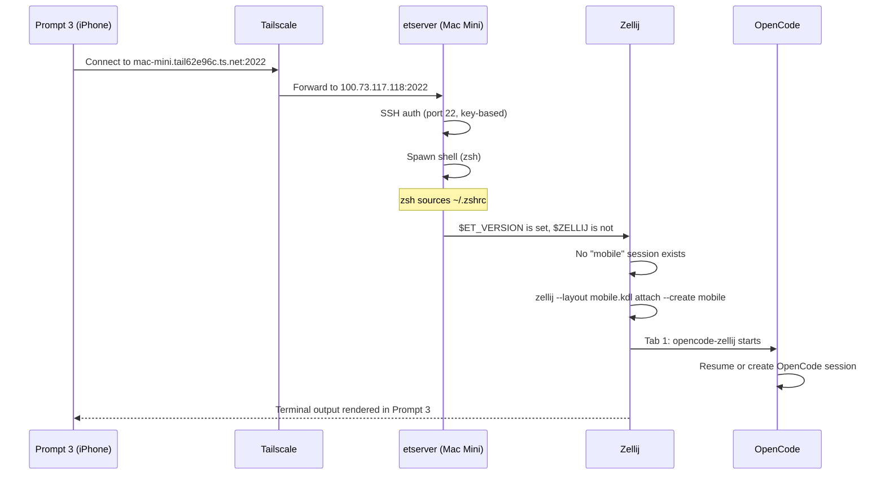
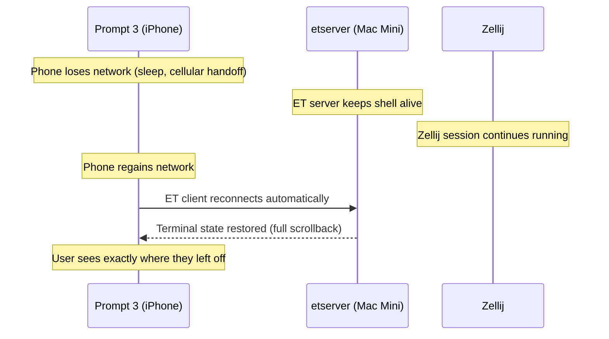
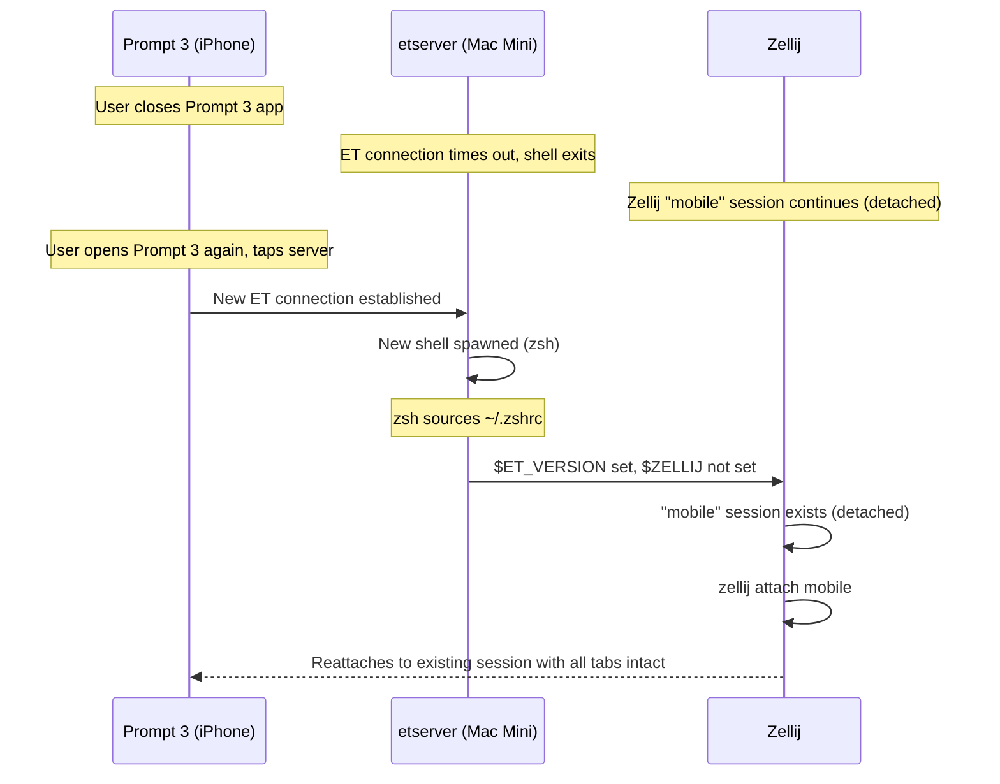

# Mobile OpenCode Specification

**Status:** Planned (not yet implemented, needs revision — zellij removed)
**Created:** 2026-04-15
**Depends on:** tmux (replaces former zellij dependency)

## Overview

A system for reliably running OpenCode from an iPhone using Prompt 3, with persistent terminal sessions and full history. The connection path is: Prompt 3 (iOS) -> Tailscale VPN -> Eternal Terminal -> Zellij session -> OpenCode. The system survives network changes, phone sleep/wake cycles, and cellular/WiFi transitions without losing the terminal session or OpenCode conversation state.

## Problem Statement

Running OpenCode from a mobile phone has several challenges:

1. **Network instability.** Mobile connections drop frequently (sleep, cellular handoffs, WiFi changes). Plain SSH sessions die on each drop, losing context.
2. **Session persistence.** OpenCode conversations are long-running. Losing a terminal session means losing visible context and potentially interrupting an active operation.
3. **Terminal history.** Reviewing previous OpenCode output requires scrollback. Some remote terminal protocols (notably Mosh) break native scrollback.
4. **Screen real estate.** Phone screens are small. Multi-pane layouts that work on a desktop are unusable on mobile.

## Architecture

```
┌───────────────────┐     Tailscale VPN      ┌─────────────────────────────┐
│  iPhone            │◄─────────────────────►│  Mac Mini (mac-mini)         │
│  Prompt 3          │    100.73.117.118      │  mac-mini.tail62e96c.ts.net  │
│  100.74.182.97     │                        │                              │
│                    │   Eternal Terminal      │  etserver :2022              │
│                    │◄─────────────────────►│    └─► zsh                    │
│                    │   (over Tailscale)      │         └─► zellij "mobile"  │
│                    │                        │              ├─► opencode tab │
│                    │                        │              └─► shell tab    │
└───────────────────┘                        └─────────────────────────────┘
```

### Layer Responsibilities

| Layer | Role | Failure mode |
|-------|------|-------------|
| **Tailscale** | Encrypted mesh VPN. Makes the Mac Mini reachable from anywhere via stable IP/hostname. | If Tailscale is down, no connectivity at all. Tailscale itself reconnects automatically on network changes. |
| **Eternal Terminal** | Resilient remote shell protocol. Handles reconnection after network drops without losing the session. Uses SSH for initial auth, then maintains its own encrypted TCP connection on port 2022. | If the ET connection drops, ET reconnects automatically when the network returns. The server-side shell process continues running. |
| **Zellij** | Terminal multiplexer. Provides persistent sessions that outlive the ET connection. Multiple tabs without pane splits (phone-friendly). Session serialization preserves state across zellij restarts. | If zellij crashes (rare), `session_serialization` allows resurrection. OpenCode session binding (via `opencode-zellij`) restores the correct conversation. |
| **OpenCode** | AI coding agent running inside a zellij tab. Conversations persist in SQLite database. Session can be resumed with `--session` flag. | OpenCode sessions are inherently persistent in the DB. Even if the terminal dies mid-conversation, the session can be resumed. |

### Why Eternal Terminal Over Mosh

| Feature | Mosh | Eternal Terminal | Impact |
|---------|------|-----------------|--------|
| Survives network changes | Yes | Yes | Both work |
| Native scrollback | **No** | **Yes** | Critical for reviewing OpenCode output on phone. Mosh replaces the SSH transport and discards scroll history. With Mosh you can only scroll via Zellij's scroll mode (Ctrl+s), which is clunky on a phone touchscreen. ET preserves native scrollback so Prompt 3's swipe-to-scroll works. |
| Protocol | UDP (port range 60000-61000) | TCP (single port 2022) | ET is simpler to firewall/configure. Mosh needs a UDP port range opened. |
| tmux/zellij compatibility | Works, but no scroll | Full compatibility | ET is transparent to the multiplexer. |
| Prompt 3 support | Built-in | Built-in | Both are first-class connection types in Prompt 3. |
| Latency prediction | Yes (speculative local echo) | No | Mosh's local echo is nice on high-latency connections, but not critical for OpenCode (you're mostly reading output, not typing fast). |

The scrollback issue alone makes Mosh a poor fit. On a phone, swiping to scroll through OpenCode's output is the primary interaction. Mosh breaks this entirely.

## File Map

### New Files

| Path | Purpose | Status |
|------|---------|--------|
| `~/.config/zellij/layouts/mobile.kdl` | Phone-optimized zellij layout (tabs only, no splits) | Planned |

### Modified Files

| Path | Change | Status |
|------|--------|--------|
| `Brewfile` | Add `brew "MisterTea/et/et"` | Planned |
| `dot_ssh/config.tmpl` | Add `mac-mini` Tailscale host entry | Planned |
| `dot_zshrc.tmpl` | Add Zellij auto-attach on ET connections | Planned |

### Chezmoi Integration

The mobile layout should be tracked in chezmoi. The path mapping:

```
Repository:  private_dot_config/zellij/layouts/mobile.kdl
Deployed to: ~/.config/zellij/layouts/mobile.kdl
```

Note: the existing zellij config (`config.kdl`) and other layouts (`tsc-dev.kdl`, `seo-dev.kdl`, `dotfiles-dev.kdl`) are not yet tracked in chezmoi (see `zellij-workspaces.md` Future Work). The mobile layout can be added independently, but ideally all zellij config should be migrated to chezmoi together.

### External Dependencies

| Dependency | Purpose | Install |
|-----------|---------|---------|
| Eternal Terminal (et + etserver) | Resilient remote terminal | `brew install MisterTea/et/et` |
| Tailscale | Mesh VPN | Already installed (`cask "tailscale-app"` in Brewfile) |
| Zellij | Terminal multiplexer | Already installed (`brew "zellij"` in Brewfile) |
| Prompt 3 | iOS terminal app | App Store (manual install on iPhone) |

## Network Topology

### Tailscale Nodes

| Node | Tailscale IP | Tailscale hostname | OS | Role |
|------|-------------|-------------------|-----|------|
| Mac Mini | 100.73.117.118 | mac-mini.tail62e96c.ts.net | macOS | Server (ET + zellij host) |
| iPhone 12 Mini | 100.74.182.97 | iphone-12-mini.tail62e96c.ts.net | iOS | Client (Prompt 3) |
| MacBook Air | 100.71.161.30 | macbook-air.tail62e96c.ts.net | macOS | Alternate client (offline) |
| GL-MT6000 | 100.91.35.10 | gl-mt6000.tail62e96c.ts.net | Linux | Router/subnet router |

### Port Requirements

| Port | Protocol | Service | Direction |
|------|----------|---------|-----------|
| 22 | TCP | SSH (used by ET for initial auth) | iPhone -> Mac Mini |
| 2022 | TCP | Eternal Terminal | iPhone -> Mac Mini |

Both ports only need to be reachable over the Tailscale network (100.x.x.x). No public internet exposure required. Tailscale handles NAT traversal.

## Connection Flow

### First Connection (New Session)



### Reconnection After Network Drop



### Reconnection After Prompt 3 Closed Entirely



## Implementation Details

### 1. Eternal Terminal Installation and Configuration

**Brewfile addition:**

```ruby
brew "MisterTea/et/et"
```

**Post-install setup:**

```bash
# Install ET
brew install MisterTea/et/et

# Start the ET server daemon
sudo brew services start MisterTea/et/et
```

This installs both `et` (client binary) and `etserver` (daemon). Homebrew creates a LaunchDaemon plist at `/Library/LaunchDaemons/homebrew.mxcl.et.plist` that starts `etserver` on boot.

**etserver defaults:**

- Listens on port 2022 (TCP)
- Uses SSH (port 22) for initial authentication
- No additional configuration file needed for basic use
- Config file location if needed: `/etc/et.cfg`

**Verification:**

```bash
# Check etserver is running
sudo brew services list | grep et

# Test from another Tailscale node
et mac-mini.tail62e96c.ts.net
```

### 2. SSH Configuration

**Addition to `dot_ssh/config.tmpl`:**

```
Host mac-mini
  HostName mac-mini.tail62e96c.ts.net
  User tis
```

This provides a named host entry for both direct SSH and ET's initial auth handshake. No IdentityFile specified -- uses the default `~/.ssh/id_rsa` (already managed by chezmoi as `encrypted_private_id_rsa`).

**Note:** This SSH config is deployed to the Mac Mini by chezmoi. For Prompt 3 on iOS, the equivalent configuration is set manually in the app (see Prompt 3 Setup section).

### 3. Zellij Auto-Attach on ET Login

**Addition to `dot_zshrc.tmpl`:**

```bash
# Auto-attach to zellij on Eternal Terminal connections
if [[ -n "$ET_VERSION" ]] && [[ -z "$ZELLIJ" ]]; then
    if zellij list-sessions 2>/dev/null | grep -q "^mobile"; then
        exec zellij attach mobile
    else
        exec zellij --layout ~/.config/zellij/layouts/mobile.kdl attach --create mobile
    fi
fi
```

**Design decisions:**

- **`$ET_VERSION` check.** Eternal Terminal sets this environment variable in the spawned shell. This ensures auto-attach only triggers on ET connections, not local terminal sessions or plain SSH. The variable is always set by ET regardless of version.
- **`$ZELLIJ` check.** Prevents nested zellij sessions. Zellij sets `$ZELLIJ=0` in all pane shells. Without this guard, opening a new shell inside zellij would try to attach again.
- **`exec` prefix.** Replaces the shell process with zellij. When zellij detaches or exits, the ET connection closes cleanly (no orphan shell). Without `exec`, detaching from zellij would drop back to a bare shell inside ET, which is confusing.
- **`list-sessions` check.** Differentiates between "attach to existing" and "create new with layout". The `attach --create` flag handles both cases, but we want to apply the mobile layout only on first creation, not override an existing session's layout.
- **Session name `mobile`.** Distinct from the workspace sessions (`tsc-dev`, `seo-dev`, `dotfiles-dev`). This avoids conflicts -- you can have a mobile session and workspace sessions running simultaneously. From the mobile session, use `Ctrl+o w` (session manager) to switch to a workspace session if needed.

**Placement in `.zshrc`:** This block should go after tool initialization (atuin, zoxide, fzf, starship, direnv) but before any interactive-only configuration. It must be after `oh-my-zsh` is sourced since `exec` replaces the shell process and nothing after it runs.

### 4. Mobile Zellij Layout

**File: `~/.config/zellij/layouts/mobile.kdl`**

```kdl
layout {
    default_tab_template {
        pane size=1 borderless=true {
            plugin location="zellij:tab-bar"
        }
        children
        pane size=2 borderless=true {
            plugin location="zellij:status-bar"
        }
    }
    tab name="opencode" focus=true {
        pane command="opencode-zellij"
    }
    tab name="shell" {
        pane
    }
}
```

**Design decisions:**

- **No pane splits.** A phone screen is too narrow for side-by-side panes and too short for stacked panes. All interaction is through tabs.
- **Two tabs.** Tab 1 (opencode) is the primary workspace. Tab 2 (shell) is for running commands, checking git status, etc. Additional tabs can be created on the fly with `Ctrl+t n`.
- **`opencode-zellij` wrapper.** Uses the existing session binding system (see `opencode-zellij.md`) to resume the correct OpenCode conversation.
- **Tab bar + status bar.** Same chrome as the workspace layouts (catppuccin-mocha theme). The status bar shows the current mode and available keys -- essential on a phone where you can't easily remember keybindings.
- **`focus=true` on opencode tab.** Opens directly into the OpenCode conversation. On a phone, the fewer taps to get to the AI, the better.

### 5. Prompt 3 Configuration (Manual, on iPhone)

Prompt 3's server configuration is stored in the app (synced via Panic Sync if enabled). This cannot be automated via chezmoi.

**Steps:**

1. Open Prompt 3 on iPhone
2. Tap **+** to add a new server
3. Configure:
   - **Nickname:** Mac Mini
   - **Connection Type:** Eternal Terminal
   - **Host:** `mac-mini.tail62e96c.ts.net`
   - **Port:** 2022
   - **Username:** `tis`
   - **Authentication:** Key-based (import the private key or generate a new key pair in Prompt 3)
4. Under advanced settings:
   - **Terminal Type:** xterm-256color
   - **Scrollback:** Maximum available (ET supports native scrollback)
5. Save and connect

**SSH key for Prompt 3:**

The private key on the Mac Mini is `~/.ssh/id_rsa` (managed by chezmoi, age-encrypted). Options for getting the key onto the iPhone:

- **Generate a new key pair in Prompt 3** and add the public key to `~/.ssh/authorized_keys` on the Mac Mini. This is the most secure approach -- the private key never leaves the phone.
- **Import the existing key** via AirDrop, iCloud Drive, or Panic Sync. Less secure (key travels between devices) but simpler.

Recommendation: Generate a dedicated key pair in Prompt 3. Add the public key to the Mac Mini's `authorized_keys`. This way, revoking phone access is as simple as removing one line from `authorized_keys`.

## Interaction With Existing Workspace System

The mobile session is independent from the workspace sessions:

```
Zellij sessions on Mac Mini:
├── mobile          ← created by ET auto-attach, phone-optimized layout
├── tsc-dev         ← created by tsc-workspace script
├── seo-dev         ← created by seo-workspace script
└── dotfiles-dev    ← created by dotfiles-workspace script
```

### Switching Between Sessions

From the mobile session, you can switch to any workspace session:

```
Ctrl+o w            # opens session manager
                    # select tsc-dev, seo-dev, etc.
```

This is useful when you want to interact with a project-specific workspace (e.g., check the Django dev server in tsc-dev tab 1) from your phone.

**Caveat:** Workspace sessions use multi-pane layouts designed for desktop. They will be cramped on a phone screen. Use `Ctrl+p f` (fullscreen) to maximize a single pane when working from a workspace session on mobile.

### OpenCode Session Binding

The mobile session uses `opencode-zellij` (same wrapper as workspace sessions). Session binding works identically:

- The `.map` file for the mobile session is stored at `~/.local/share/opencode-zellij/mobile.map`
- Snapshot/restore with `zs` works the same way
- If you run `opencode-zellij` in the mobile session while a workspace session also has an opencode pane for the same project, the binding system ensures each pane resumes its own session (not the other's)

## Verification Checklist

After implementation, verify each layer:

### 1. Tailscale Connectivity

```bash
# From iPhone (via Prompt 3 SSH, before ET setup)
ping mac-mini.tail62e96c.ts.net
```

### 2. ET Server Running

```bash
# On Mac Mini
sudo brew services list | grep et
# Should show: et started

# Check port is listening
lsof -i :2022
# Should show etserver
```

### 3. ET Connection Works

```bash
# From another Tailscale node (e.g., MacBook Air)
et mac-mini.tail62e96c.ts.net

# Or from Prompt 3 directly
# (configure ET connection type, connect)
```

### 4. Auto-Attach Works

```bash
# After connecting via ET, you should land directly in zellij
# Verify:
echo $ZELLIJ          # should be "0"
echo $ET_VERSION      # should show ET version
zellij list-sessions  # should show "mobile" session
```

### 5. Resilience Test

1. Connect from Prompt 3 via ET
2. Verify you're in the zellij mobile session with OpenCode running
3. Toggle airplane mode on the iPhone
4. Wait 10 seconds
5. Disable airplane mode
6. ET should reconnect automatically -- same zellij session, same OpenCode output visible

### 6. Full Disconnect/Reconnect Test

1. Connect from Prompt 3, verify zellij mobile session
2. Force-close Prompt 3 entirely (swipe up from app switcher)
3. Wait 30 seconds (ET server-side timeout)
4. Reopen Prompt 3, tap the Mac Mini server
5. New ET connection should auto-attach to the existing zellij "mobile" session
6. OpenCode tab should show the full conversation history

## Security Considerations

- **Tailscale encryption.** All traffic between iPhone and Mac Mini is encrypted by WireGuard (Tailscale's underlying protocol). ET adds its own encryption layer on top.
- **No public exposure.** Port 2022 only listens on the Tailscale interface (100.x.x.x). The Mac Mini does not need any ports open on the public internet.
- **SSH key auth only.** Password auth should be disabled for SSH on the Mac Mini. ET inherits SSH's auth mechanism.
- **Dedicated mobile key.** Using a separate key pair for the phone (generated in Prompt 3) allows revoking phone access independently without affecting other SSH keys.
- **ET server runs as root.** The `etserver` LaunchDaemon runs as root (required to spawn user shells). This is the same privilege model as `sshd`. The ET codebase is open source and auditable at https://github.com/MisterTea/EternalTerminal.

## Known Issues / Gotchas

- **ET Homebrew tap may change.** The current tap is `MisterTea/et/et`. If this changes, the Brewfile entry needs updating. Check https://github.com/MisterTea/EternalTerminal for current install instructions.

- **`$ET_VERSION` variable reliability.** The auto-attach logic depends on ET setting `$ET_VERSION` in the spawned shell. This has been consistent across ET versions, but if a future version stops setting it, the auto-attach won't trigger. A fallback check could use `$SSH_CONNECTION` (which ET also sets), but that would also trigger on plain SSH connections.

- **`exec zellij` means no shell after detach.** Using `exec` to replace the shell with zellij means detaching from zellij closes the ET connection (the shell process is gone). This is intentional -- on a phone, you always want to be in zellij. If you need a bare shell, connect via plain SSH instead of ET, or create a new tab in zellij.

- **First connection requires Tailscale to be active on both devices.** If Tailscale is paused on the iPhone or the Mac Mini, the connection fails. The Tailscale iOS app must be running (it runs as a VPN profile, so it persists in the background unless manually paused).

- **Prompt 3 background behavior.** iOS may suspend Prompt 3 when it's in the background for extended periods. ET handles the reconnection, but there may be a brief delay (1-3 seconds) when switching back to the app. This is an iOS limitation, not an ET or Tailscale issue.

- **Zellij keybindings on phone keyboard.** Prompt 3 has a customizable keyboard toolbar for modifier keys (Ctrl, Alt, Esc). The default toolbar includes Ctrl and Esc, which is sufficient for basic zellij navigation. For frequent use, configure the toolbar to include Alt (needed for `Alt+h/l` tab navigation).

- **Phone screen width.** The zellij tab bar, status bar, and OpenCode's own UI all consume vertical space. On an iPhone 12 Mini (5.4" screen), the usable terminal area in landscape mode is approximately 80x20 characters. Portrait mode gives approximately 45x35. OpenCode works in both orientations but landscape is more readable for code output.

- **ET server and macOS sleep.** If the Mac Mini goes to sleep, all ET connections die and zellij sessions are preserved (zellij runs in userspace, not as a daemon). When the Mac wakes, ET clients reconnect and zellij sessions are reattachable. To prevent sleep-related disconnects, ensure the Mac Mini is configured to never sleep (System Settings > Energy > Prevent automatic sleeping when the display is off).

- **Multiple simultaneous ET connections.** If you connect from both the iPhone and another device (e.g., MacBook Air) via ET, the second connection will spawn a separate shell. The auto-attach will try to attach to the "mobile" session, but zellij only allows one client per session at a time. The second client will see "Session 'mobile' is already being attached to by another client." Workaround: use a different session name for the second device, or detach the first client first.

## Future Work

- **Per-device session names.** Instead of hardcoding "mobile", derive the session name from the connecting device (e.g., `$ET_CLIENT_IP` or a Prompt 3-set environment variable). This would allow multiple devices to each have their own persistent session.

- **Dedicated `authorized_keys` management in chezmoi.** Currently `~/.ssh/authorized_keys` is not tracked by chezmoi. Adding it would allow declarative management of which devices can connect.

- **ET configuration file.** For advanced tuning (keepalive intervals, logging, allowed users), create `/etc/et.cfg` and manage it via chezmoi (would require a script or root-level chezmoi target).

- **Auto-snapshot on ET disconnect.** When ET detects a client disconnect, trigger a zellij snapshot. ET doesn't have disconnect hooks, but a workaround would be monitoring `etserver` logs or using a zellij WASM plugin (same approach discussed in `opencode-zellij.md` Future Work).

- **Workspace launcher from mobile session.** A simplified `workspace` command that can be run from the mobile zellij shell tab to switch to (or create) a project workspace session, without needing to remember `tsc-workspace` / `seo-workspace` script names.

- **Prompt 3 Clips integration.** Configure Prompt 3's Clips feature (text snippets) with frequently used commands: `tsc-workspace`, `seo-workspace`, `zs`, `Ctrl+o w`. Clips can be tapped from the keyboard toolbar, reducing typing on the phone.

- **iPad support.** The iPad Mini 6th gen is on the Tailscale network (`100.123.148.59`, currently offline). The same Prompt 3 + ET setup would work. The iPad's larger screen could support the desktop workspace layouts (multi-pane) instead of the mobile layout. A separate `tablet.kdl` layout with conservative splits could be useful.
