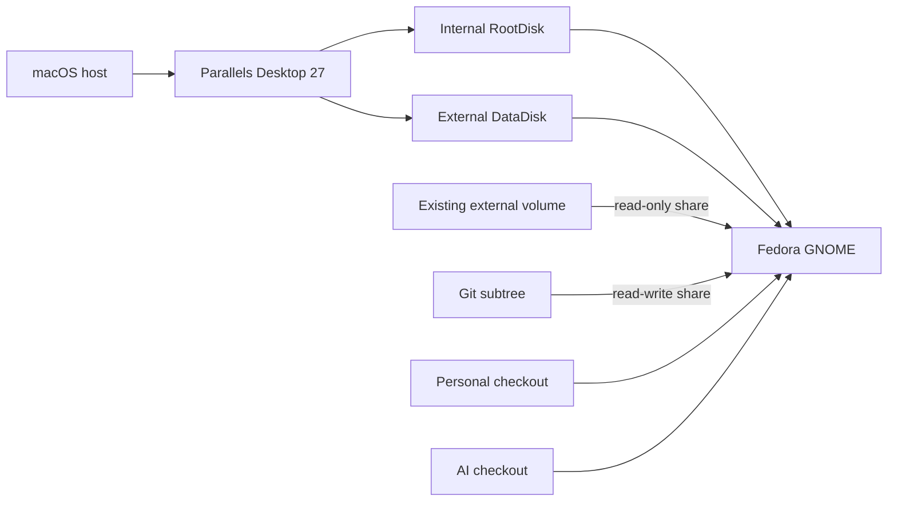
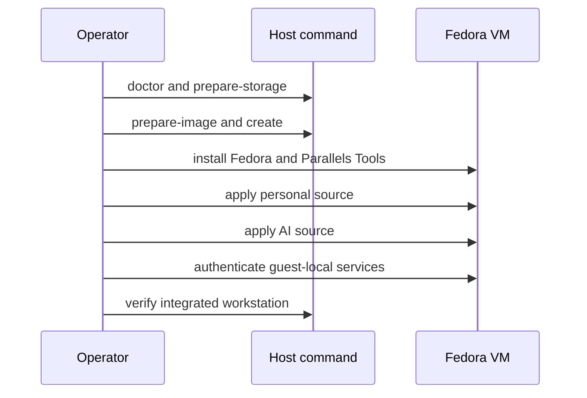

# Parallels Fedora Workstation

## Overview

This context manages one Fedora 44 ARM64 GNOME daily-driver VM through Parallels
Desktop 27 Pro. The host declaration, storage topology, VM lifecycle, personal
Fedora configuration, integration checks, update recovery, and rebuild procedure
remain reviewable in the personal dotfiles source.

The current Initiative override is elevated risk. It adds an APFS volume,
virtual disks, host shares, privileged guest package installation, tailnet SSH,
and persistent unencrypted guest credentials. Delivery includes a draft pull
request and exact approved local rollout.

## Goals

- Create and operate one persistent but frequently rebuildable Fedora desktop.
- Keep latency-sensitive root and home behavior internal while moving bulky
  supported state to the external guest disk.
- Reuse host project worktrees without exposing the VM backing disk through its
  own share.
- Apply the personal and AI chezmoi sources with explicit disjoint ownership.
- Keep Fedora current without automatic reboot or silent Parallels Tools loss.

## Non-goals

No VM clones, automatic startup, automatic snapshots, unattended upgrades,
ChatGPT desktop client, Sway/Hyprland, declarative GNOME ricing, host credential
copy, or automatic private-state deletion is included.

## Domain

| Term | Definition |
|---|---|
| `FedoraWorkstation` | Parallels VM and Fedora installation named `fedora-parallels`. |
| `RootDisk` | Internal expanding 64 GiB virtual disk containing Fedora, `/home`, and latency-sensitive state. |
| `DataDisk` | Preserved expanding 160 GiB ext4 virtual disk mounted at `/mnt/data`. |
| `ParallelsVolume` | Plain APFS sibling volume mounted at `/Volumes/Parallels` with a 200 GiB quota. |
| `HostExternalShare` | `/Volumes/ext` exposed to Fedora at `/mnt/host/ext` read-only. |
| `HostGitShare` | `/Volumes/ext/git` exposed at `/mnt/host/git` read-write. |
| `ResourceProfile` | Stopped-VM CPU/RAM setting: lean 4/8, daily 6/12, or heavy 8/20. |
| `PersonalFedoraProfile` | Personal chezmoi `machine_type=fedora-workstation`. |
| `StateSentinel` | Regular owner-safe marker proving the expected data root is mounted and writable. |

The guest hostname is `fedora-parallels`; the installation creates user `tis`.
Passwords, account identifiers, tailnet identity, and application logins remain
machine-local.

## Behavior

### Host preparation

- Given APFS container `disk9` contains the mounted `ext` volume, when explicit
  preparation runs, then it creates only a missing plain APFS `Parallels` sibling
  with 200 GiB quota and verifies the resulting volume identity.
- Given the container, existing name, mount, quota, or available capacity differs,
  preparation refuses without erase, delete, repartition, or fallback.
- Adding the sibling volume does not require unplugging the SSD or unmounting
  `ext`, but the operator avoids concurrent heavy I/O and verifies the container
  again immediately before mutation.

### VM creation and profiles

- Given Parallels 27 is installed and activated, `fedora-parallels create`
  creates one stopped ARM64 VM with daily 6 CPU/12 GiB RAM, shared NAT, the
  internal root disk, external data disk, and exact custom shares.
- Given the VM exists, create refuses rather than cloning or replacing it.
- Given the VM is not stopped, `profile lean|daily|heavy` refuses without
  stopping, suspending, or restarting it.
- The VM never starts automatically at macOS login.

### Image and installation

- Fedora Workstation Live 44-1.7 aarch64 is eligible only after the official
  checksum file's OpenPGP signature and image SHA-256
  `162ba3c552a2d241c7c63ec26777af0255ee1b5a135adc0be986ceed999933ef`
  pass.
- Fedora installation, disk selection, user password, and first boot remain
  interactive. The external data disk is not formatted during a root reinstall.
- Parallels Tools installation uses the Apple Silicon Linux Tools image and
  matching running-kernel development packages, then requires a reboot.

### State and rebuilding

- The data disk persists downloads, supported caches, containers, Flatpak
  runtimes, JetBrains state, and AI runtime state across root reinstalls.
- Compatible application state remains in place. If a new release rejects state,
  the old directory is retained under an operator-reviewed name before fresh
  state is created.
- Cache reset names one rebuildable group. No reset implicitly removes auth,
  sessions, downloads, Atuin history, container volumes, or IDE local history.
- Rebuild is deliberately not one destructive command: stop the VM, detach and
  preserve the data disk, review removal of the old VM/root disk, recreate the
  VM, reinstall Fedora, reattach by stable disk identity, and reapply both sources.

### Updates and recovery

- `fedora-update` runs one `dnf upgrade --refresh`, never runs redundant `dnf
  update`, never reboots, and reports whether restart is required.
- Fedora retains its normal install-only kernel rollback set.
- After reboot, verification checks the running kernel, Parallels graphics,
  resizing, clipboard, and both shares. Failure uses a retained kernel when
  needed and reinstalls Tools against the running kernel before retrying.

## Interfaces

Host command:

```text
fedora-parallels doctor
fedora-parallels prepare-storage
fedora-parallels prepare-image
fedora-parallels create
fedora-parallels profile lean|daily|heavy
fedora-parallels status
fedora-parallels verify
```

Guest commands:

```text
fedora-update
fedora-reset-cache GROUP
fedora-verify
```

Unknown commands, unsafe state, missing mounts, and unsupported installed CLI
capabilities fail before mutation. There is no managed delete command.

## Architecture



**Text Equivalent:** Parallels runs Fedora with an internal root disk and a
separate ext4 data disk backed by a sibling external APFS volume. Fedora can read
the whole existing host external volume, but only its nested Git share is
writable. Personal and AI configuration come from independent guest checkouts.



**Text Equivalent:** Storage is verified before Parallels and image preparation.
The VM is then created and Fedora plus Parallels Tools are installed manually.
Personal configuration applies before AI configuration. Guest-local services are
authenticated only afterward, followed by integrated verification.

## Visual Evidence Plan

| Concern | Decision | Canonical evidence |
|---|---|---|
| Boundary | required: storage and ownership flowchart | Architecture flowchart and Text Equivalent |
| Interaction | required: creation/configuration sequence | Sequence diagram and Text Equivalent |
| State | required: lifecycle behavior is represented by explicit create/profile/rebuild/update scenarios | Behavior sections |
| Data/trust | required: share modes, storage, and credential location appear in the boundary flowchart | Architecture flowchart |
| Schema | not applicable: exact command and value tables are clearer than a schema visual | Domain and Interfaces |
| Dependency/deployment | required: source and installation order appears in the sequence | Sequence diagram |
| Quantitative | not applicable: approved capacities and profiles are fixed configuration, not comparative evidence | Domain table |

## Risks And Accepted Risk

- APFS quotas do not reserve capacity. Growth of either sibling volume can still
  exhaust the shared container; status must report actual capacity and allocation.
- Disconnecting external storage while the VM is running or suspended risks I/O
  failure. Host start and profile operations require the exact mounted volume.
- The operator accepts storing AI auth/session state, IDE local history, and
  container data on unencrypted external storage under trusted physical custody.
- Parallels shared-folder latency and cross-platform build artifacts can affect
  development. One operating system edits a shared worktree at a time, and native
  dependencies are rebuilt when switching.

## Validation Strategy

- Run all configured tests on Python 3.12, 3.13, and 3.14.
- Render every machine type and compare existing macOS and `lmsh` targets.
- Test command generation and refusal behavior without invoking `diskutil` or
  `prlctl` in unit tests.
- Parse rendered shell, TOML, and JSON; run `git diff --check`.
- Verify live APFS identity/quota, Parallels version/help, VM configuration,
  image signature/digest, disks, network, startup, and share permissions.
- Verify Fedora package/app presence, data mount identity, cross-source target
  separation, updates, reboot recovery, and Parallels Tools integrations.

## Gate Ledger

| Gate | Applicability | Result |
|---|---|---|
| Domain | required | pending |
| Behavior | required | pending |
| Spec | required | pending |
| Contract | required | pending |
| Test-driven implementation | required | pending |
| Refactor | required | pending |
| Review/Integrate | required | pending |
| Release | not applicable: no versioned artifact is published | not run |
| Deploy | required | pending |
| Operate | required | pending |
| Maintain/Retire | required | pending |
