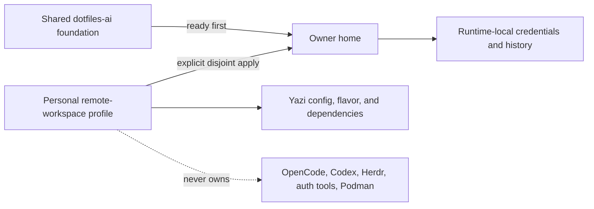

# Remote Workspace Profile

## Outcome

The owner may explicitly apply a narrow Yazi-only overlay after the shared
`dotfiles-ai` foundation is ready. The overlay derives only the Yazi portion of
the existing `lmsh` allowlist for CentOS Stream 10 x86_64. Shared `dotfiles-ai`
retains Bash, Atuin, Starship, OpenCode, Codex, Herdr, gcloud, 1Password,
Podman, and bootstrap ownership.

The stable Engineering Profile is [`PROFILE.md`](PROFILE.md).

## Domain

- `RemoteWorkspaceProfile`: explicit `machine_type=remote-workspace` intent.
- `SharedFoundation`: the authoritative public `dotfiles-ai` managed-target set.
- `PersonalOverlay`: owner-only Yazi configuration, flavor, and portable Yazi
  dependency installation.
- `TargetAllowlist`: deny-by-default Yazi subset derived from the existing
  `lmsh` role.

## Behavior

### Explicit owner apply

- **Given** the shared foundation is ready for the owner
- **When** the owner initializes and applies `machine_type=remote-workspace`
- **Then** only the approved Yazi allowlist is managed
- **And** no infrastructure or shared-agent target changes ownership.

### Another user does not receive personal state

- **Given** another OS Login user receives the shared foundation
- **When** their first-login bootstrap converges
- **Then** this personal source is not cloned or applied
- **And** no owner account, endpoint, history, key, or credential is projected.

### Ownership collision

- **Given** rendered managed-target sets from both sources
- **When** any path appears in both sets
- **Then** validation fails before apply
- **And** neither source transfers ownership automatically.

### Safe rollback

- **Given** the owner applied the personal overlay
- **When** the overlay rolls back or is removed
- **Then** the prior managed-target manifest is restored
- **And** Atuin history, authentication, keys, and unrelated files remain intact.

## Interfaces And Contracts

- Add `remote-workspace` as an explicit machine type; do not infer it from host,
  username, employer, client, architecture, or repository path.
- Add an explicit `remote-workspace` allowlist containing only Yazi package and
  theme configuration, the locked flavor installer, and portable Yazi runtime
  dependencies. Bash, common profile, Atuin, and Starship remain excluded.
- Support x86_64 with reviewed release assets and SHA-256 checksums. Installed
  binaries must also be disjoint from the shared foundation's installed files.
- Applying the overlay is explicit and user-owned; root bootstrap and private
  workspace infrastructure do not map an OS Login identity to this repository.

## Visual Evidence Plan

| Concern | Decision | Review question | Canonical source |
|---|---|---|---|
| Boundary | `required: target ownership flowchart` | Which source owns each target? | Diagram below |
| Interaction | `not_applicable` | Explicit apply follows standard chezmoi interaction | Behavior |
| State | `not_applicable` | Shared bootstrap owns readiness state | Remote-development contract |
| Data/trust | `required: target ownership flowchart` | Where may personal endpoint and credentials exist? | Diagram below |
| Schema | `not_applicable` | Existing scalar TOML data is sufficient | Interfaces |
| Dependency/deployment | `required: target ownership flowchart` | Why must shared readiness precede personal apply? | Diagram below |
| Quantitative | `not_applicable` | No quantitative decision exists | Validation |

**Text Equivalent:** The public foundation applies first and owns Bash, Atuin,
Starship, agent runtimes, authentication tooling, and Podman helpers. The owner
then explicitly applies a deny-by-default personal subset containing only Yazi
configuration, flavor, and portable dependencies. Credentials and history
remain outside personal source state. Validation rejects any rendered or
installed target overlap.

## Validation

- Run the full repository pytest suite.
- Render every existing macOS and `lmsh` profile plus `remote-workspace`.
- Compare exact rendered and installed target sets from both sources and require
  empty intersections.
- Parse rendered TOML, verify x86_64 checksums and executable versions, and prove
  a second apply is empty.
- Prove rollback preserves local history, keys, auth state, and unrelated files.

## Implementation

- `machine_type=remote-workspace` renders only Yazi `package.toml`, `theme.toml`,
  the flavor installer, and the remote-workspace Yazi installer.
- The installer places checksum-verified Yazi and `ya` 26.8.15, fd 10.5.0,
  fzf 0.74.3, and 7-Zip 26.02 x86_64 binaries in `~/.local/bin` without root.
- The official Catppuccin Mocha flavor remains revision- and hash-locked in
  `package.toml`; Bash, Atuin, Starship, agents, authentication, Podman, and
  bootstrap remain outside the overlay.

## Readiness

RWUE-003 source implementation is complete under the approved Initiative
receipt. Applying it to an owner home remains explicit and requires the shared
foundation to be ready first.
