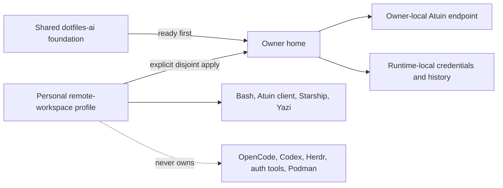

# Remote Workspace Profile

## Outcome

The owner may explicitly apply a narrow personal terminal overlay after the
shared `dotfiles-ai` foundation is ready. The overlay generalizes the existing
`lmsh` allowlist for CentOS Stream 10 x86_64 and never owns OpenCode, Codex,
Herdr, gcloud, 1Password, Podman, or shared bootstrap targets.

The stable Engineering Profile is [`PROFILE.md`](PROFILE.md).

## Domain

- `RemoteWorkspaceProfile`: explicit `machine_type=remote-workspace` intent.
- `SharedFoundation`: the authoritative public `dotfiles-ai` managed-target set.
- `PersonalOverlay`: the owner-only Bash, common profile, Atuin, Starship, Yazi,
  and terminal installer targets.
- `TargetAllowlist`: deny-by-default set derived from the existing `lmsh` role.
- `OwnerAtuinEndpoint`: non-secret machine-local HTTPS endpoint used only by the
  owner's independent Atuin client and account.

## Behavior

### Explicit owner apply

- **Given** the shared foundation is ready for the owner
- **When** the owner initializes and applies `machine_type=remote-workspace`
- **Then** only the approved terminal allowlist is managed
- **And** no infrastructure or shared-agent target changes ownership.

### Another user does not receive personal state

- **Given** another OS Login user receives the shared foundation
- **When** their first-login bootstrap converges
- **Then** this personal source is not cloned or applied
- **And** no owner account, endpoint, history, key, or credential is projected.

### Ownership collision

- **Given** rendered managed-target sets from both sources
- **When** any path appears in both sets
- **Then** validation fails before apply
- **And** neither source transfers ownership automatically.

### Safe rollback

- **Given** the owner applied the personal overlay
- **When** the overlay rolls back or is removed
- **Then** the prior managed-target manifest is restored
- **And** Atuin history, authentication, keys, and unrelated files remain intact.

## Interfaces And Contracts

- Add `remote-workspace` as an explicit machine type; do not infer it from host,
  username, employer, client, architecture, or repository path.
- Start from the existing `lmsh` target allowlist: Bash profile, Bash rc, common
  profile, Atuin client config, Starship, Yazi, and their portable installers.
- Support x86_64 with reviewed release assets and SHA-256 checksums.
- Store the owner's Atuin endpoint in machine-local TOML. Never store account
  credentials, encryption keys, tailnet identity, or enrollment state there.
- Keep Atuin sync disabled until the owner authenticates and the endpoint health
  check succeeds.
- Applying the overlay is explicit and user-owned; root bootstrap and private
  workspace infrastructure do not map an OS Login identity to this repository.

## Visual Evidence Plan

| Concern | Decision | Review question | Canonical source |
|---|---|---|---|
| Boundary | `required: target ownership flowchart` | Which source owns each target? | Diagram below |
| Interaction | `not_applicable` | Explicit apply follows standard chezmoi interaction | Behavior |
| State | `not_applicable` | Shared bootstrap owns readiness state | Remote-development contract |
| Data/trust | `required: target ownership flowchart` | Where may personal endpoint and credentials exist? | Diagram below |
| Schema | `not_applicable` | Existing scalar TOML data is sufficient | Interfaces |
| Dependency/deployment | `required: target ownership flowchart` | Why must shared readiness precede personal apply? | Diagram below |
| Quantitative | `not_applicable` | No quantitative decision exists | Validation |

**Text Equivalent:** The public foundation applies first and owns agent runtimes,
authentication tooling, and Podman helpers. The owner then explicitly applies a
deny-by-default personal subset containing only terminal files. The owner-local
Atuin endpoint, credentials, and history remain outside public and shared source
state. Validation rejects any managed-target overlap.

## Validation

- Run the full repository pytest suite.
- Render every existing macOS and `lmsh` profile plus `remote-workspace`.
- Compare exact managed-target sets from both chezmoi sources and require an
  empty intersection.
- Parse rendered Bash and TOML, verify x86_64 checksums, and prove a second apply
  is empty.
- Prove owner Atuin health and sync without exposing history or account data.
- Prove rollback preserves local history, keys, auth state, and unrelated files.

## Readiness

The profile and ownership contracts are ready. Implementation remains blocked on
RWUE-001 shared-foundation delivery and a fresh Initiative receipt and approval.
