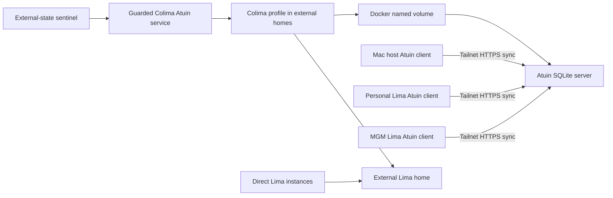

# Shell Auth Startup

## Engineering Profile

| Concern | Default |
| --- | --- |
| Deliverable and owner | Personal chezmoi shell configuration and single-user Atuin service; operator owned |
| Runtime | macOS arm64 workstations and Fedora arm64 Lima guests; Bash; Atuin `18.17.1` |
| Platform | Docker on Colima, SQLite WAL storage, and Tailscale Serve HTTPS |
| Interfaces | Chezmoi `machine_type`, shell startup files, Atuin `config.toml`, Compose, `/healthz`, and Atuin sync protocol |
| Compatibility | Existing macOS rendering remains unchanged; `machine_type=lmsh` receives the portable terminal subset |
| Trust/data | Shell commands, arguments, working directories, account sessions, and encryption keys are sensitive |
| Deployment | Test account before migration; preserve hosted history and key; close registration after cutover |
| Operations | Loopback container ingress, tailnet-only HTTPS, health checks, bounded client timeouts, cold SQLite backup and restore |
| Maintenance | Pin image and clients, review updates and accepted risks, retain rollback until restore is proven |
| Authorities | Chezmoi rendering, shell syntax, pytest contracts, Compose validation, health/sync probes, lifecycle audit, and independent review |

Current cycle `AUTH-020-transfer-opencode-package-ownership` is routine
managed-configuration work. It transfers package ownership without changing
authentication, secrets, or services. No progressive module applies.
Release and Operate are not applicable; Deploy, Maintain/Retire, and
Review/Integrate are required.

The approved Fedora Parallels Initiative adds a dependency-gated full workstation
profile specified in
[`features/fedora-workstation.md`](features/fedora-workstation.md). It does not
change the delivered `lmsh` allowlist or existing macOS behavior until its exact
Build slice is approved and deployed.

The approved Dual-Source Chezmoi Apply Initiative adds one Mac-mini-only,
dependency-gated bridge specified in
[`features/dual-source-chezmoi-apply.md`](features/dual-source-chezmoi-apply.md).
It preserves personal target ownership while chaining the independently managed
`dotfiles-ai` source after a normal full personal apply.

## Domain

Bounded context: shell authentication startup for interactive panes, agents, and status-bar plugins.

Entities:
- `LoginShell`: shell started by terminal, Herdr pane, or SSH.
- `SecretLoader`: sourceable `secret` command that exports credentials into current shell.
- `OnePasswordCommand`: `op` CLI command that can require app integration or biometric approval.
- `TemplateRenderer`: chezmoi render path that must not require live 1Password access.
- `PersonalSourceRoot`: the authoritative personal source checkout on the Mac
  mini external volume, with a portable home-directory checkout on other
  machines.
- `HerdrPane`: restored or newly opened Herdr pane with `HERDR_ENV` set.
- `HerdrServer`: persistent pane owner configured by the external `dotfiles-ai` source and launched in the macOS Aqua bootstrap context.
- `ClockifyPoller`: SketchyBar plugin that checks current Clockify timer.
- `TerminalProfile`: portable Bash, Atuin, zoxide, and Starship configuration
  selected by chezmoi machine intent and operating system.
- `TerminalFileManager`: Yazi plus the command-line tools available to its
  search, navigation, archive, and preview adapters.
- `CwdWrapper`: shell-local `y` command that adopts Yazi's final directory when
  the user exits with `q` and preserves the original directory with `Q`.
- `YaziFlavor`: locked Catppuccin Mocha package selected by Yazi's dark flavor
  setting.
- `ExternalCacheRoot`: mounted Mac mini cache storage below `/Volumes/ext/state/cache`.
- `NativeCacheClient`: Playwright, uv, pre-commit, or npm configured
  through its supported cache-path interface.
- `PulumiHome`: Pulumi's credential, workspace, schema, and plugin directory,
  selected through its supported `PULUMI_HOME` interface.
- `TerminalTargetAllowlist`: deny-by-default set of files and scripts that the
  personal source may apply to an `lmsh` guest.
- `OpenCodePackageOwner`: the external `dotfiles-ai` source that installs the
  native OpenCode CLI; this personal source retains only desktop and shell
  integration.
- `OpenCodeWrapper`: shell function that resolves the managed local wrapper
  before package-manager binaries even after later PATH changes.
- `AtuinClient`: one machine-local history database, record store, encryption
  key, and authenticated sync session.
- `AtuinServer`: pinned single-user container accepting authenticated encrypted
  record synchronization.
- `AtuinStore`: SQLite WAL database in a persistent Docker named volume on the
  Colima Linux filesystem, outside Git and macOS file sharing.
- `ExternalLimaHome`: Mac-mini-only Lima instance and sparse disk storage at
  `/Volumes/ext/state/lima`.
- `ExternalColimaHome`: Mac-mini-only Colima profile and download-cache storage
  under `/Volumes/ext/state`.
- `ColimaAtuinService`: guarded login service that starts Colima only when the
  external-state sentinel and all configured state roots exist.
- `TailnetEndpoint`: Tailscale-terminated HTTPS proxy to loopback-only server
  ingress.

Value objects:
- `CachedClockifyApiKey`: local API key file used by the poller.
- `OnePasswordSessionCache`: local token cache under `~/.cache/op/session`.
- `OnePasswordServiceAccountToken`: per-session token injected into SSH/Herdr environments as `OP_SERVICE_ACCOUNT_TOKEN`.
- `MacOSKeychainServiceToken`: local login-Keychain item that stores `OnePasswordServiceAccountToken` for Herdr panes.
- `ShellSecretsItem`: consolidated 1Password item containing every secret required by `SecretLoader`.
- `ShellSecretsVault`: non-Personal 1Password vault (`Automation`) containing `ShellSecretsItem` for service-account access.
- `InjectedSecretBundle`: JSON document produced by the `ShellSecretsItem` fetch.
- `OnePasswordItemId`: stable item UUID used to fetch a secret item without title search.
- `ProjectedSecretSet`: validated JSON object containing every scalar secret and file payload needed by the shell.
- `SessionCredentialDirectory`: private temporary directory created by one shell and inherited by its child processes.
- `CommandTimeout`: maximum wall time for external auth calls.

Events:
- `LoginShellStarted`
- `SecretLoadRequested`
- `OnePasswordCommandTimedOut`
- `HerdrPaneRestored`
- `ClockifyPollSkipped`
- `HistoryRecordedLocally`
- `HistorySyncRequested`
- `AtuinServerUnavailable`
- `HostedHistoryMigrated`
- `AtuinRegistrationClosed`
- `TerminalFileManagerInstalled`
- `TerminalFileManagerExited`

Glossary:
- **Startup-safe**: shell/profile path must not block on interactive auth or network credentials.
- **Fail-fast**: auth command exits with an error after a bounded timeout.
- **Poll loop**: recurring SketchyBar script execution driven by `update_freq`.
- **lmsh:** portable personal terminal profile shared by personal and MGM Lima
  guests; it does not imply a shared VM filesystem or client identity.
- **Cold backup:** complete copy of stopped SQLite config storage, including WAL
  companions when present.

## Behavior Scenarios

**Scenario: Portable source owns the OpenCode CLI package**
- Given `dotfiles-ai` installs the native OpenCode CLI
- When this personal Brewfile is applied
- Then it declares neither the OpenCode tap nor formula
- And the separately owned OpenCode desktop cask remains installed

**Scenario: Local OpenCode wrapper survives later PATH updates**
- Given an executable `~/.local/bin/opencode` wrapper
- When another package directory is prepended to PATH after shell startup
- Then `opencode` still invokes the local wrapper with all arguments unchanged

### Feature: Startup-safe Herdr panes

**Scenario: Restored Herdr pane starts without auth fanout**
- Given many `HerdrPane` instances are restored at once
- When each `LoginShell` starts
- Then no `SecretLoader` runs automatically
- And no `OnePasswordCommand` runs from shell startup

**Scenario: Mac mini uses the authoritative external source**
- Given a parent tool exports a component-specific `XDG_DATA_HOME`
- And `machine_type=mac-mini`
- When the user invokes plain `chezmoi`
- Then chezmoi resolves `PersonalSourceRoot` as
  `/Volumes/ext/git/Personal/dotfiles`
- And it does not derive a second source checkout beneath the component XDG tree
- And source editing does not require cross-filesystem hardlinks

**Scenario: Other machines retain a portable personal source**
- Given `machine_type` is not `mac-mini`
- When the user invokes plain `chezmoi`
- Then chezmoi resolves `PersonalSourceRoot` under
  `${HOME}/.local/share/chezmoi`

**Scenario: Marimo uses Catppuccin Mocha globally**
- Given chezmoi applies the managed marimo configuration
- When marimo starts on a managed workstation
- Then marimo selects dark mode
- And it loads the pinned Catppuccin Latte/Mocha stylesheet from the user's
  marimo configuration directory

**Scenario: Herdr server starts in the GUI security context**
- Given the user has an active Aqua login session
- When the managed `HerdrServer` starts
- Then launchd runs it with `LimitLoadToSessionType=Aqua`
- And no credential is stored in its plist or environment configuration
- And restored `HerdrPane` processes can request the login-Keychain service token

### Feature: Fail-fast secret loading

**Scenario: OnePassword command hangs**
- Given `SecretLoadRequested` runs while `OnePasswordCommand` is wedged
- When an `op read` or session probe exceeds `CommandTimeout`
- Then `SecretLoader` fails fast
- And partial credential state is cleaned up

**Scenario: Secrets are loaded from one consolidated item**
- Given `SecretLoadRequested` runs with a valid 1Password session
- When `SecretLoader` resolves required secrets
- Then it fetches exactly one `ShellSecretsItem` by `OnePasswordItemId`
- And it projects them into one `ProjectedSecretSet`
- And it exports all required environment variables
- And it materializes required credential files
- And missing required values fail the whole load

**Scenario: Loaded credentials remain valid**
- Given `SecretLoader` previously completed in a `LoginShell`
- When it is requested again and every required credential file is non-empty
- Then it returns without fetching or rematerializing secrets

**Scenario: A loaded credential file disappears**
- Given `SecretLoader` previously completed in a `LoginShell`
- And a required credential file is missing or empty
- When it is requested again
- Then it clears stale loaded state
- And it fetches and rematerializes every required credential file

**Scenario: Concurrent shells isolate credential files**
- Given two `LoginShell` instances request secrets
- When each materializes required credential files
- Then each uses a distinct private `SessionCredentialDirectory`
- And one shell's cleanup cannot remove files referenced by the other shell or its child processes

**Scenario: SSH session uses injected service account token**
- Given `SecretLoadRequested` runs in an SSH `LoginShell`
- And `OnePasswordServiceAccountToken` is present in the environment
- When the token passes the session validity probe
- Then `SecretLoader` uses that token for the `ShellSecretsItem` fetch
- And no biometric session mint is attempted
- And no `OnePasswordSessionCache` is written

**Scenario: Herdr session uses Keychain-backed service account token**
- Given `SecretLoadRequested` runs in a `HerdrPane`
- And no `OnePasswordServiceAccountToken` is present in the environment
- And a `MacOSKeychainServiceToken` exists
- When the token passes the session validity probe
- Then `SecretLoader` uses that token for the `ShellSecretsItem` fetch
- And no biometric or delegated `op signin` is attempted
- And no `OnePasswordSessionCache` is read or written
- And the `ShellSecretsItem` fetch specifies `ShellSecretsVault`
- And `SecretLoader` sources sibling `op-session` directly instead of using shell command lookup

**Scenario: Herdr session lacks service account token**
- Given `SecretLoadRequested` runs in a `HerdrPane`
- And no `OnePasswordServiceAccountToken` is present in the environment
- And no `MacOSKeychainServiceToken` is available
- When `SecretLoader` resolves 1Password authentication
- Then it fails fast without calling `op signin`
- And it tells the user to configure a Keychain-backed `OP_SERVICE_ACCOUNT_TOKEN`

**Scenario: Herdr cannot read the Keychain service token**
- Given the Keychain item exists but macOS denies non-interactive access
- When `SecretLoader` resolves 1Password authentication
- Then it reports the Keychain failure without exposing the token
- And it provides Keychain Access guidance that trusts `/usr/bin/security`
- And it does not call delegated `op signin`

**Scenario: SSH session lacks service account token**
- Given `SecretLoadRequested` runs in an SSH `LoginShell`
- And no valid `OnePasswordSessionCache` is available
- And no `OnePasswordServiceAccountToken` is present in the environment
- When `SecretLoader` resolves 1Password authentication
- Then it fails fast without calling `op signin`
- And it tells the user to inject `OP_SERVICE_ACCOUNT_TOKEN`

**Scenario: Cached session is stale**
- Given `SecretLoadRequested` reads a cached `OnePasswordSessionCache`
- When the cached token is expired or rejected by the session validity probe
- Then `SecretLoader` mints one fresh `OnePasswordSessionCache` in a TTY shell
- And no grouped item fetch starts before the session is valid
- And partial credential state is cleaned up

**Scenario: Exported session is stale while a lock remains**
- Given `OnePasswordSessionEnv` contains a stale token
- And `OnePasswordSessionLock` remains from an earlier attempt
- When the session validity probe rejects the exported token
- Then `SecretLoader` discards the exported token
- And it force-mints one fresh `OnePasswordSessionCache` in a TTY shell
- And it removes the stale lock before minting

### Feature: Clockify polling without auth storm

**Scenario: Cached Clockify API key is missing**
- Given `ClockifyPoller` runs in its poll loop
- And no `CachedClockifyApiKey` exists
- When the poller checks Clockify state
- Then it does not call `OnePasswordCommand`
- And it hides the Clockify item

### Feature: Portable terminal profile

**Scenario: Lima shell starts with personal terminal behavior**
- Given a Linux machine has `machine_type=lmsh`
- When chezmoi applies the personal source and Bash starts
- Then only portable shell configuration is rendered
- And Atuin, zoxide, and Starship initialize only when installed
- And macOS applications, LaunchAgents, credential helpers, and private keys are
  not installed
- And shell startup performs no network authentication

**Scenario: Full source initialization remains terminal-only**
- Given the personal source also contains macOS, credential, editor, and AI
  automation targets
- When chezmoi evaluates that source with `machine_type=lmsh`
- Then only the Bash/common profiles, Atuin and Starship configuration, and the
  pinned terminal installer are eligible to apply
- And unrelated files and scripts remain ignored even when later added to the
  personal source

**Scenario: Managed workstations launch Yazi with the practical tool set**
- Given `machine_type` is `macbook` or `mac-mini`
- When chezmoi applies the personal source
- Then Homebrew installs Yazi, 7-Zip, fd, ripgrep, and resvg
- And Yazi reuses the managed ffmpeg, jq, Poppler, fzf, zoxide, ImageMagick, and
  Nerd Font dependencies already present
- And Kitty requires no Yazi-specific configuration

**Scenario: Portable guests launch Yazi without privileged installation**
- Given Fedora arm64 has `machine_type=lmsh`
- When chezmoi applies the portable terminal subset
- Then pinned Yazi, fd, fzf, and 7-Zip binaries install below `~/.local/bin`
- And Yazi reuses the guest's existing file, jq, and ripgrep commands
- And no package manager or privileged command runs

**Scenario: Yazi adopts its final directory**
- Given an interactive Bash, Zsh, or Xonsh shell has Yazi installed
- When the user launches `y` and exits with `q`
- Then `CwdWrapper` changes the parent shell to Yazi's final directory
- And exiting with `Q` leaves the parent shell directory unchanged
- And the temporary cwd file is removed after Yazi exits

**Scenario: Yazi uses Catppuccin Mocha**
- Given the locked `YaziFlavor` is installed
- When Yazi starts in dark mode
- Then it selects `catppuccin-mocha`
- And package installation uses the revision and hash recorded in managed
  `package.toml`

**Scenario: Guest preview helper is unavailable**
- Given Yazi runs inside an `lmsh` guest
- And Poppler, ffmpeg, resvg, or ImageMagick is absent in that guest
- When Yazi encounters the corresponding PDF, video, SVG, or advanced image
- Then the unsupported preview is unavailable without affecting navigation,
  search, archive handling, or file opening
- And host-side preview tools are not treated as guest executables

### Feature: Private self-hosted history sync

### Feature: Native external caches

**Scenario: External cache volume is available**
- Given the Mac mini state sentinel exists
- When an interactive shell starts
- Then Playwright, uv, pre-commit, and npm receive native paths below
  `ExternalCacheRoot`
- And Pulumi uses `/Volumes/ext/state/pulumi` as `PulumiHome`

**Scenario: External cache volume is unavailable**
- Given the Mac mini state sentinel is absent
- When an interactive shell starts
- Then no external CLI cache variable is exported
- And each CLI retains its native local default

**Scenario: Tailnet client reaches Atuin**
- Given the pinned Atuin container is healthy on Mac loopback
- When an authorized Mac or Lima client connects to the stable tailnet URL
- Then Tailscale terminates HTTPS and proxies to the loopback service
- And no LAN or public listener exposes the container

**Scenario: Server is unavailable**
- Given an authenticated client cannot reach the Atuin server
- When the shell records and searches history
- Then local capture and search continue
- And encrypted unsynchronized records remain durable locally
- And bounded network timeouts prevent an unbounded shell delay
- And a later successful sync reconciles missing record chains

**Scenario: Hosted history moves after isolated validation**
- Given a disposable account synchronized between the Mac and both Lima clients
- And the hosted client has completed a final sync and local backup
- When the operator preserves the existing encryption key, registers the local
  account, and changes the sync endpoint
- Then existing local encrypted records upload to the self-hosted server
- And a second client decrypts the same representative history
- And the hosted account remains available for rollback until restore is proven

**Scenario: Registration closes after migration**
- Given the production account exists and client sync passes
- When the server restarts with open registration disabled
- Then existing authenticated clients continue to sync
- And an unregistered client cannot create another account

**Scenario: SQLite store is recoverable**
- Given the server is stopped cleanly
- When the stopped named volume is exported and restored in isolation
- Then the restored `/healthz` succeeds
- And an authenticated client can synchronize without changing its encryption
  key

**Scenario: Lima and Colima use external state on the Mac mini**
- Given the Mac mini external-state sentinel and managed roots exist
- When a shell, sandbox controller, or guarded Colima service invokes Lima
- Then direct Lima instances, Colima profile state, container images, and Docker
  volumes use their native external homes
- And teammate and non-Mac-mini defaults remain unchanged

**Scenario: External VM state is unavailable**
- Given the external-state sentinel or a managed state root is absent
- When the guarded Colima service starts
- Then it exits without creating an internal fallback profile
- And existing external VM state remains untouched

**Scenario: Lost Atuin server is reconstructed from clients**
- Given the server volume is absent and each client has a validated cold backup
- And surviving clients retain distinct host identities and the same encryption key
- When an empty server temporarily opens registration and clients synchronize normally
- Then the server receives the union of encrypted client record streams
- And registration closes after host and both Lima clients verify shared history

## Contracts & Invariants

### LoginShell
- **Invariant:** profile startup must not invoke `secret` automatically.
- **Invariant:** profile startup must not run `op` commands.

### TemplateRenderer
- **Invariant:** `chezmoi status` and `chezmoi apply` must not call template-time `onepasswordRead` for routine config files.
- **Invariant:** `.chezmoi.toml.tmpl` renders `/Volumes/ext/git/Personal/dotfiles`
  for `machine_type=mac-mini` and `<home>/.local/share/chezmoi` otherwise.
- **Invariant:** chezmoi edit hardlinks are disabled only when the Mac mini uses
  the external source because temporary storage is on another filesystem.
- **Compatibility:** the source pin does not choose the initial clone location;
  it preserves the canonical source after `chezmoi init` has rendered config.

### SecretLoader
- **Pre:** `secret` is sourced, not executed.
- **Post:** every `op` command either returns successfully or fails within `CommandTimeout`.
- **Post:** failed secret loading unsets `_SECRETS_LOADED`.
- **Invariant:** secret values are parsed from `InjectedSecretBundle` as JSON, not shell-evaluated text.
- **Invariant:** `ShellSecretsItem` is fetched by `OnePasswordItemId`, not title lookup.
- **Invariant:** `ShellSecretsItem` is fetched from `ShellSecretsVault` so service-account reads satisfy 1Password CLI vault scoping.
- **Invariant:** `SecretLoader` performs one secret item fetch per load after session validation.
- **Invariant:** required fields are projected into `ProjectedSecretSet` by one JSON projection step before exports or file writes.
- **Invariant:** the grouped secret path requires `jq` for JSON field extraction.
- **Invariant:** installed `SecretLoader` sources sibling `op-session` by path so stale shell command hashes cannot select an old broker.
- **Post:** all required secrets are non-empty before `_SECRETS_LOADED` is set.
- **Invariant:** `_SECRETS_LOADED` is trusted only while both exported credential paths name non-empty files.
- **Invariant:** each loading shell materializes GCP credentials in a distinct mode-700 temporary directory.
- **Post:** stale loaded state forces a complete reload and rematerialization.
- **Invariant:** shell exit does not remove a `SessionCredentialDirectory` that a live child process may still reference; the operating system's temporary-storage lifecycle reclaims abandoned directories.

### OnePasswordSessionCache
- **Invariant:** cached tokens must pass one bounded validity probe before grouped item fetches start.
- **Invariant:** `OnePasswordServiceAccountToken` takes precedence over cached and biometric session paths.
- **Invariant:** `HerdrPane` uses `OnePasswordServiceAccountToken` from environment or `MacOSKeychainServiceToken` only; it must not call delegated desktop `op signin`.
- **Invariant:** `MacOSKeychainServiceToken` service/account values and `op-session` are managed by the machine-local `dotfiles-ai` configuration.
- **Invariant:** Keychain failures retain actionable diagnostics without printing credential values.
- **Invariant:** Keychain repair is explicit and interactive; `SecretLoader` never mutates Keychain ACLs.
- **Invariant:** repair guidance does not use `security -w` interactive input because it truncates the service-account token.
- **Invariant:** `HerdrServer` runs in the Aqua launchd domain without embedding credentials in its plist; this repository does not own that plist.
- **Invariant:** chezmoi deployment never stops an unmanaged `HerdrServer`; initial handoff is explicit or occurs at the next GUI login.
- **Post:** valid service account tokens must not call `op signin` or write `OnePasswordSessionCache`.
- **Post:** invalid service account tokens fail fast with a service-account-specific error.
- **Post:** SSH shells without a service account token must not attempt biometric or password-based `op signin`.
- **Post:** stale exported session tokens are discarded before a forced mint.
- **Post:** stale cached tokens are refreshed once in a TTY shell before parallel 1Password item fetches run.
- **Post:** non-TTY shells fail fast when no valid cached token is available.

### ClockifyPoller
- **Invariant:** recurring poll path reads `CachedClockifyApiKey` only.
- **Invariant:** recurring poll path never calls `op read`.
- **Post:** missing API key hides the Clockify item and exits successfully.

### TerminalProfile
- **Invariant:** `.chezmoi.os` expresses platform and `machine_type=lmsh`
  expresses Lima terminal intent.
- **Invariant:** macOS rendering remains byte-compatible outside intentional
  Atuin endpoint and daemon changes.
- **Invariant:** optional shell tools are command-guarded.
- **Invariant:** `OpenCodePackageOwner` is `dotfiles-ai`; this source must not
  declare the OpenCode tap or CLI formula.
- **Invariant:** `OpenCodeWrapper` exists only when the local executable exists
  and forwards its argument vector unchanged.
- **Invariant:** the lmsh target excludes SSH private keys, GitHub credentials,
  1Password integration, GUI applications, and macOS service configuration.
- **Invariant:** Yazi and its shell wrappers are owned by this personal source;
  the external `dotfiles-ai` source remains unchanged.
- **Invariant:** macOS uses Homebrew for Yazi and the practical dependency set.
- **Invariant:** lmsh installs pinned upstream arm64 binaries without root access
  and does not install media, PDF, SVG, or advanced-image preview helpers.
- **Invariant:** `yazi` and `ya` have exactly matching versions.
- **Invariant:** `CwdWrapper` validates that Yazi's returned path is a directory
  before changing the parent shell directory and removes its temporary file.
- **Invariant:** `YaziFlavor` is locked by revision and content hash; managed
  `theme.toml` contains only the dark flavor selection.
- **Invariant:** external CLI cache exports are Mac-mini-only and require the
  existing `/Volumes/ext/state/.dotfiles-ai-state` sentinel.
- **Invariant:** `LIMA_HOME`, `COLIMA_HOME`, and `COLIMA_CACHE_HOME` are
  Mac-mini-only. Lima and Colima use native home controls rather than state-directory symlinks.
- **Invariant:** the guarded Colima service requires the sentinel and every
  external home directory before invoking Colima; it never falls back internally.
- **Invariant:** the dotfiles-ai sandbox `lima_home` is machine-local and empty
  by default, so teammate configurations retain Lima's native default.
- **Invariant:** Playwright, uv, pre-commit, and npm use only their
  documented native path controls; shell-wide `XDG_CACHE_HOME` and cache
  symlinks are not used.
- **Invariant:** Pulumi, Prefect, and Codex use their documented native home
  controls only on the Mac mini with the external-state sentinel present.
- **Invariant:** Codex GUI processes receive the same native `CODEX_HOME` through
  the Mac-mini-only login environment; missing-sentinel startup removes only the
  managed value.
- **Invariant:** PyCharm settings and plugins remain internal; its regenerable
  system directory uses `idea.system.path` only on the Mac mini.
- **Pre:** migrated Prefect and Codex SQLite files pass integrity and runtime
  activation checks before internal rollback copies may be removed.
- **Invariant:** `TerminalTargetAllowlist` denies all targets by default and
  re-includes only `.bash_profile`, `.bashrc`, `.common_profile`,
  `.config/atuin/config.toml`, `.config/starship.toml`, Yazi configuration, the
  Yazi flavor installer, and `install-lmsh-terminal.sh`.

### AtuinServer
- **Invariant:** server and clients use pinned compatible Atuin `18.17.1`.
- **Invariant:** the tailnet endpoint is machine-local chezmoi data and never
  enters source, rendered diagnostics, or public lifecycle artifacts.
- **Invariant:** the container publishes only to `127.0.0.1`; Tailscale Serve is
  the only remote ingress.
- **Invariant:** the image is `ghcr.io/atuinsh/atuin:18.17.1` and the state URI is
  `sqlite:///config/atuin.db`.
- **Invariant:** SQLite WAL state uses a Docker named volume rather than a macOS
  bind mount; bind-mounted WAL produced a live `disk I/O error` during validation.
- **Invariant:** open registration is an explicit temporary deployment override
  and defaults to false.
- **Invariant:** credentials, sessions, encryption keys, databases, and backups
  stay outside Git and command output.
- **Post:** successful migration retains the original encryption key and closes
  registration.

### AtuinClient
- **Invariant:** clients keep unique local host identity and databases; internal
  Atuin state is never copied between active clients.
- **Invariant:** the server address is tailnet HTTPS, automatic sync is bounded,
  and built-in secret filtering remains enabled.
- **Invariant:** `atuin key`, raw credential retrieval, and password-bearing
  commands are excluded from history collection.
- **Post:** remote failure does not prevent local history search or capture.

### Accepted Risk
- `AUTH-013-AR1`: on 2026-08-09 the operator approved storing Prefect history and
  Codex authentication/session state, and PyCharm Local History on the existing
  unencrypted, `noowners` external volume after each exposure was reported.
  Sentinel fallback, validated copies, and physical custody reduce availability
  and migration risk but do not provide encryption or local ownership isolation.
  Owner: operator. Review before the volume leaves trusted custody, another local
  account gains access, or the storage policy changes; encrypt the volume when
  operationally feasible.
- `AUTH-011-AR1`: the operator approved moving Pulumi credentials and executable
  caches to the existing unencrypted, `noowners` external state volume after the
  trust limitation was reported. The state sentinel, retained internal rollback
  copies, and trusted physical custody compensate but do not provide encryption
  or offline tamper resistance. Owner: operator. Review before the volume leaves
  trusted custody, another local account gains access, or the storage policy
  changes.
- `AUTH-009-AR1`: the operator approved synchronizing MGM shell history through
  the same personal account, making work commands and paths decryptable on
  personal clients. End-to-end encryption, secret filters, tailnet-only ingress,
  and local credential isolation compensate but do not satisfy employer policy.
  Owner: operator. Review by 2026-08-18 or before connecting another work client.

## Verification

- Shell syntax checks pass for edited scripts.
- Rendered Mac mini shell startup selects external CLI caches only with the
  sentinel present; absent-sentinel startup retains local defaults.
- Prefect preserves 802 runs, passes SQLite `quick_check`, and serves a healthy
  local API from the external home.
- Codex CLI and GUI use the external home; copied SQLite databases pass
  `quick_check` and live file handles resolve externally.
- PyCharm control restart opens the external system directory without internal
  cache file handles.
- Static search confirms no Herdr profile auto-`secret` block remains.
- Static search confirms Clockify poller has no `op read` call.
- Static search confirms Databricks config has no `onepasswordRead` call.
- Pytest verifies lmsh exclusions, command guards, pinned assets, loopback-only
  Compose, closed-by-default registration, and bounded Atuin configuration.
- Pytest verifies machine-specific source selection and the pinned marimo theme.
- Pytest verifies managed Yazi packages, pinned lmsh assets, the restricted
  target allowlist, Catppuccin Mocha selection, and Bash/Zsh/Xonsh wrappers.
- Rendered shell checks and focused wrapper tests prove `y` adopts a valid final
  directory, preserves the current directory otherwise, and removes its
  temporary cwd file.
- `ya pkg list`, `yazi --version`, and `ya --version` verify the locked flavor
  and matching CLI versions after deployment.
- Rendered config and browser-computed CSS verify dark mode and the Mocha base
  palette after targeted deployment.
- `docker compose config` validates the rendered service.
- Mac and both Lima clients resolve the tailnet endpoint and receive healthy
  HTTPS without a public or LAN listener.
- Disposable-account synchronization passes before production migration.
- Production validation compares representative history across two clients,
  verifies denied registration, exercises offline recovery, and restores one
  cold backup in isolation.

## Visual Evidence

| Concern | Classification |
| --- | --- |
| Boundary | not_applicable: shell/process ownership is fully specified by the credential-directory invariants. |
| Interaction | not_applicable: behavior scenarios state load, reload, and cleanup ordering directly. |
| State | not_applicable: `_SECRETS_LOADED` has only valid and stale states with an explicit file guard. |
| Data/trust | not_applicable: credential sensitivity, permissions, and lifetime are explicit contracts above. |
| Schema | not_applicable: no persistent schema exists. |
| Dependency/deployment | required: AUTH-014 moves Lima and Colima state to an external APFS volume and replaces the failing Homebrew service with a guarded login service. |
| Quantitative | not_applicable: no decision depends on quantitative evidence. |

AUTH-019 adds no required visual. Package ownership, cwd handoff, and the
macOS/lmsh capability difference are fully represented by behavior and contract
text; no spatial, state, trust, schema, quantitative, or deployment decision is
made clearer by another diagram.

AUTH-020 changes package ownership and command resolution without changing a
runtime boundary or interaction sequence, so no visual requires revision.

**Text Equivalent:** On the Mac mini, the external-state sentinel authorizes a
guarded service to start Colima with native external homes. Colima stores the
Atuin SQLite database in a Docker named volume inside its Linux disk. The Mac,
personal Lima VM, and MGM Lima VM keep distinct client databases and synchronize
encrypted records through the tailnet HTTPS endpoint. Direct Lima instances and
Colima share the external Lima home without filesystem-sharing active databases.
