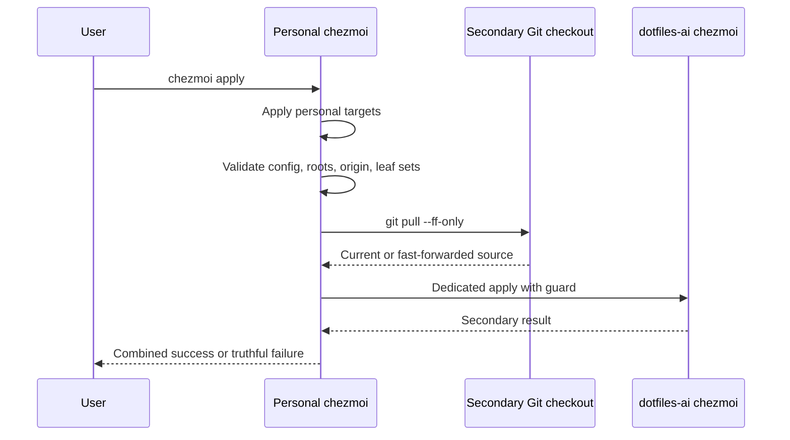

# Dual-Source Chezmoi Apply

**Status:** Ready

## Scope

On `machine_type=mac-mini`, a normal unqualified full `chezmoi apply` first
finishes the personal source and then invokes the independently configured
`dotfiles-ai` source. Other machines and targeted, dry-run, status, diff, edit,
update, and explicit-source operations retain existing behavior.

Risk is elevated because one command runs two source-controlled deployment
pipelines and fast-forwards the secondary checkout. Delivery is a draft pull
request followed by a live Mac-mini apply. `dotfiles-ai` is a read-only dependency
for this slice; no target ownership moves.

## Interface

The personal source owns exactly one Mac-mini-rendered
`run_after_apply-dotfiles-ai.sh.tmpl`. Its runtime contract is:

1. Exit successfully when `DOTFILES_AI_CHAINED_APPLY=1`; no third apply is
   permitted.
2. Require regular, non-symlinked
   `~/.config/dotfiles-ai/chezmoi.toml` without reading or printing its contents.
3. Resolve primary source with plain `chezmoi source-path` and secondary source
   with `chezmoi --config ~/.config/dotfiles-ai/chezmoi.toml source-path`.
4. Require two distinct absolute existing Git worktree roots.
   The secondary must be the checkout already selected by the dedicated config;
   the bridge never clones or derives another source directory.
5. Require secondary `origin` to normalize exactly to
   `Saltiola7/dotfiles-ai` over supported HTTPS or SSH GitHub syntax.
6. Compute both rendered managed sets with `--include=files,symlinks,scripts` and
   fail before pull when their sorted leaf intersection is nonempty.
7. Require the current secondary branch to have an upstream and run exactly
   `git -C <secondary> pull --ff-only`. Never reset, clean, stash, switch, merge,
   rebase, force, clone, or auto-pull the personal source.
8. Recompute both rendered managed sets after the fast-forward and fail before
   secondary apply if the pulled source introduced any leaf intersection.
9. Set `DOTFILES_AI_CHAINED_APPLY=1` and run exactly
   `chezmoi --config ~/.config/dotfiles-ai/chezmoi.toml apply`.
10. Propagate any validation, pull, or secondary apply failure as the outer
   apply's nonzero result. Output contains no config content, Git URL credentials,
   source diff, environment, or managed target list.

The bridge uses the same resolved `chezmoi` executable for source queries and the
secondary apply. It rejects a missing executable and does not shell-evaluate
source paths. Existing local modifications in either checkout are never changed
by bridge logic; `git pull --ff-only` remains authoritative for whether the
secondary branch can advance safely.

## Ownership

Current rendered evidence has no shared file, symlink, or run-script target.
Shared parent directories such as `.config`, `.local/bin`, and
`Library/LaunchAgents` are not leaf ownership collisions. A future leaf collision
blocks the secondary step and requires an explicit ownership decision; the bridge
never resolves overlap by force.

The personal source owns shell, terminal, editor, and workstation targets.
`dotfiles-ai` owns OpenCode/Codex/DBSCTR/Herdr AI targets and its rolling Codex
transaction. Neither source removes the other's targets.

## Failure And Recovery

- Personal apply failure prevents the bridge from running.
- Secondary validation or pull failure occurs after personal completion, returns
  nonzero, and performs no secondary apply.
- Secondary apply failure returns nonzero and preserves each source's native
  journals/rollback behavior. The bridge does not claim cross-source rollback.
- A retry repeats idempotent personal apply, revalidates separation, retries the
  fast-forward, and then retries secondary apply.
- Offline GitHub access therefore fails the combined command, matching the
  operator-selected fail-visible policy.
- Concurrent full applies are unsupported; native source/persistent-state locks
  remain authoritative and a collision must fail rather than run a third apply.

`chezmoi status` for the personal source may contain only the expected always-run
marker for `apply-dotfiles-ai.sh`; any other line remains drift. The secondary
source retains its own expected rolling-update marker.

## Behaviors

- Given a cleanly fast-forwardable secondary checkout and disjoint managed leaf
  targets, when plain full apply runs on the Mac mini, then personal completes,
  secondary fast-forwards, secondary applies once, and the command succeeds.
- Given the bridge environment guard is already set, when the script is reached,
  then it exits without resolving, pulling, or applying either source.
- Given a target collision, unexpected origin, missing upstream, divergent branch,
  unavailable network, pull blocked by local work, or secondary apply failure,
  when the bridge runs, then it
  exits nonzero without destructive Git recovery or a success claim.
- Given a non-Mac-mini render or a targeted/dry-run operation, when chezmoi runs,
  then no secondary source is applied.

## Validation

- Fake `chezmoi`/`git` tests prove exact ordering, fixed config, recursion guard,
  origin normalization, distinct roots, pre/post-pull target intersection
  failure, fast-forward only, no personal pull, and secondary failure propagation.
- Render tests prove the bridge exists only for `machine_type=mac-mini` and uses
  no machine-specific source path in Git.
- A real read-only managed-set check proves zero current leaf intersections.
- A live dry-run proves no secondary mutation; a live full apply proves each
  source runs once, both native status contracts hold, and rolling Codex remains
  healthy on host/guests.
- Existing personal shell/auth tests and affected `dotfiles-ai` distribution tests
  remain green.

## Gate Ledger

| Gate | Applicability | Result | Authority | Owner |
|---|---|---|---|---|
| Domain | required | pending | Source, bridge, target, and failure vocabulary | Primary |
| Behavior | required | pending | Ordering, guard, overlap, pull, failure, and retry scenarios | Primary |
| Spec | required | pending | This feature specification | Primary |
| Contract | required | pending | Rendered bridge and fake command tests | Primary |
| Test-driven implementation | required | pending | Personal ownership/shell tests | Primary |
| Refactor | required | pending | Reuse native chezmoi and Git interfaces | Primary |
| Review/Integrate | required | pending | Affected QA and independent elevated-risk review | Primary |
| Release | not applicable: no public artifact | not_run | Engineering Profile | Primary |
| Deploy | required | pending | Targeted bridge apply followed by full personal apply | Primary |
| Operate | required | pending | Both sources, Codex fleet, and status-marker smoke | Primary |
| Maintain/Retire | required | pending | Failure, overlap, recursion, retry, and bridge removal tests | Primary |

## Visual Evidence

| Concern | Decision | Review question | Canonical source | Owner/change trigger |
|---|---|---|---|---|
| Boundary | required: source sequence | Where does ownership cross repositories? | Interface | Personal source owner |
| Interaction | required: source sequence | Which operations occur before failure can propagate? | Failure And Recovery | Bridge order change |
| State | not_applicable: native Git/chezmoi state remains authoritative | - | Failure And Recovery | New bridge state |
| Data/trust | required: source sequence | What crosses from personal to AI apply? | Ownership | Config/secret change |
| Schema | not_applicable: no persistent bridge schema | - | Interface | New persistence |
| Dependency/deployment | required: source sequence | Why must deployment and QA remain serial? | Interface | Dependency change |
| Quantitative | not_applicable: correctness uses set and ordering invariants | - | Validation | Metric-controlled decision |

**Text Equivalent:** The user runs plain apply. Personal targets finish first.
The bridge validates the fixed secondary config, distinct source roots, expected
origin, and disjoint leaf target sets. It fast-forwards only the tracked
`dotfiles-ai` branch, applies that source once under a recursion guard, and returns
the secondary result. Failure is visible and does not claim that already-applied
personal targets were rolled back.

## Quantitative Evidence

Build records exactly two source roots, zero shared leaf targets, one secondary
pull, one secondary apply, recursion depth at most one, and zero personal Git
mutations. Source paths, target names, config values, and Git output remain out of
public evidence.
